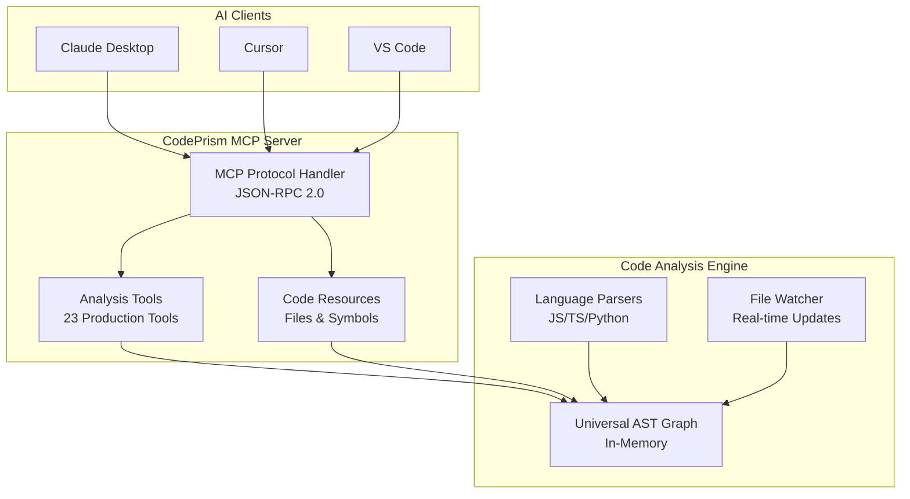

# CodePrism Architecture

This document describes the high-level architecture and design principles of CodePrism, a production-ready code intelligence server implementing the Model Context Protocol (MCP).

## System Overview

CodePrism is a **graph-based code intelligence system** that provides AI assistants with structured understanding of codebases. The system implements the Model Context Protocol specification to integrate seamlessly with AI coding assistants like Claude Desktop, Cursor, and VS Code GitHub Copilot.

### Design Philosophy

- **Graph-First Intelligence**: Code relationships are stored and queried as a graph, not flat syntax trees
- **MCP-Native**: Built specifically for the Model Context Protocol from the ground up  
- **Real-Time Updates**: Incremental parsing and graph updates for responsive user experience
- **Multi-Language**: Unified analysis across JavaScript, TypeScript, Python, and extensible to other languages

## High-Level Architecture

## Core Components

### MCP Protocol Layer
- **JSON-RPC 2.0 Transport**: Standard MCP communication via stdin/stdout
- **Capability Negotiation**: Tools, resources, and prompts registration
- **Error Handling**: Structured error responses with context

### Analysis Tools (23 Production-Ready)
- **Navigation Tools**: Symbol search, dependency analysis, path tracing
- **Code Analysis**: Security, performance, complexity analysis
- **Workflow Tools**: Batch processing, optimization suggestions

### Code Intelligence Engine
- **Universal AST**: Language-agnostic graph representation of code structure
- **Multi-Language Parsers**: Native support for JavaScript, TypeScript, Python
- **Real-Time Updates**: Incremental parsing on file changes

### Storage Architecture
- **In-Memory Graph**: High-performance graph queries using DashMap
- **Parsed AST Cache**: LRU cache for frequently accessed files
- **Optional Persistence**: File-based caching for faster startup

## Data Flow

### 1. Repository Initialization
1. **File Discovery**: Scan repository for supported file types
2. **Parallel Parsing**: Parse files using appropriate language parsers  
3. **Graph Construction**: Build universal AST graph with cross-references
4. **Index Creation**: Create symbol and dependency indexes

### 2. Client Interaction
1. **MCP Handshake**: Client connects and negotiates capabilities
2. **Tool Execution**: Client requests analysis via MCP tools
3. **Graph Query**: Tools query the in-memory graph structure
4. **Result Formatting**: Return structured analysis results

### 3. Real-Time Updates
1. **File Change Detection**: File watcher detects modifications
2. **Incremental Parsing**: Re-parse only changed files
3. **Graph Updates**: Update affected nodes and relationships
4. **Cache Invalidation**: Clear relevant cached results

## Performance Characteristics

### Target Metrics
- **Initialization**: < 2 seconds for repositories with 1,000 files
- **Tool Response**: < 500ms for complex analysis queries
- **Memory Usage**: < 1GB for 10,000 code symbols
- **Update Latency**: < 250ms for file change processing

### Optimization Strategies
- **Lazy Loading**: Parse files only when accessed or analyzed
- **Parallel Processing**: Concurrent parsing of multiple files
- **Smart Caching**: Cache frequently accessed parse results
- **Memory Management**: Automatic cleanup of unused graph nodes

## Security Model

- **Sandboxed Execution**: Read-only access to specified repository
- **Path Validation**: Prevent access outside repository boundaries
- **Resource Limits**: Memory and CPU usage constraints
- **Error Isolation**: Prevent parser errors from affecting server stability

## Language Support

### Universal AST Design
- **Language-Agnostic Representation**: Common node types across all languages
- **Cross-Language Linking**: References between files in different languages
- **Extensible Parser Framework**: Easy addition of new language support

### Currently Supported Languages
- **JavaScript/TypeScript**: Full ES6+ and TypeScript features
- **Python**: Classes, functions, imports, decorators
- **Future Languages**: Rust, Java, Go, C++ (extensible architecture)

## Deployment and Integration

### MCP Client Setup
CodePrism integrates with AI assistants through standard MCP configuration:

**Claude Desktop**: Add server configuration to `claude_desktop_config.json`
**Cursor**: Enable MCP support and add server configuration  
**VS Code**: Use with compatible MCP client extensions

### Installation Options
- **Binary Download**: Pre-built releases for Linux, macOS, Windows
- **Source Build**: Cargo-based Rust build process
- **Container**: Docker support for isolated deployment

## Future Considerations

### Extensibility
- **Plugin Architecture**: Future support for custom analysis plugins
- **Language Expansion**: Framework designed for easy language parser addition  
- **Tool Ecosystem**: Community-contributed analysis tools

### Scalability
- **Distributed Parsing**: Horizontal scaling for very large repositories
- **Persistent Storage**: Optional database backend for enterprise deployments
- **Cluster Support**: Multi-instance coordination for team environments

### Integration Opportunities
- **IDE Extensions**: Native IDE plugin development
- **CI/CD Integration**: Automated code analysis in build pipelines
- **Version Control**: Git hook integration for continuous analysis

---

**Next Steps**: See the [Getting Started Guide](./GETTING_STARTED.md) to begin using CodePrism, or explore the [Current Status](./CURRENT_STATUS.md) for detailed tool capabilities. 