# Getting Started with CodePrism - MCP Integration Guide

This guide walks you through setting up CodePrism with the three major MCP clients: Claude Desktop, Cursor, and VS Code. By the end, you'll have a powerful AI assistant with graph-first code intelligence for your repositories.

## 🎯 What You'll Achieve

- **23 production-ready analysis tools** including security, performance, and API analysis
- **AI assistants** that understand your code structure, not just text
- **Real-time analysis** of your repositories with automatic updates
- **Cross-language intelligence** for JavaScript, TypeScript, and Python projects
- **Graph-based insights** about dependencies, function calls, and relationships
- **Parser development tools** for advanced debugging and AST analysis

## 📋 Prerequisites

### Required Software
- **Node.js 18+** (for building codeprism)
- **Rust 1.82+** (for building codeprism from source)
- **Git** (for cloning repositories)

### MCP Clients (Choose one or more)
- **Claude Desktop** (macOS/Windows) - Download from [Claude.ai](https://claude.ai/download)
- **Cursor** - Download from [Cursor.sh](https://cursor.sh/)
- **VS Code** (1.86+) - Download from [code.visualstudio.com](https://code.visualstudio.com/)

### Verify Prerequisites
```bash
# Check Node.js version
node --version  # Should be 18.0.0 or higher

# Check Rust version  
rustc --version  # Should be 1.82.0 or higher

# Check Git
git --version
```

## 🚀 Step 1: Install CodePrism

### Option A: Build from Source (Recommended)
```bash
# Clone the repository
git clone https://github.com/rustic-ai /codeprism
cd codeprism

# Build the release binary
cargo build --release

# The binary will be at: ./target/release/codeprism-mcp-server
```

### Option B: Using Pre-built Binary (Coming Soon)
```bash
# Download from GitHub releases (when available)
# Extract and place in your PATH
```

### Verify Installation
```bash
# Test the binary
./target/release/codeprism-mcp-server --help

# Should show usage information and available options
```

## 🔧 Step 2: Configure MCP Clients

### Setup Workflow Overview

```mermaid
graph TD
    Start[Choose MCP Client] --> Claude{Claude Desktop}
    Start --> Cursor{Cursor}
    Start --> VSCode{VS Code}
    
    Claude --> ClaudeConfig[Locate claude_desktop_config.json]
    ClaudeConfig --> ClaudeEdit[Edit Configuration]
    ClaudeEdit --> ClaudeRestart[Restart Claude Desktop]
    ClaudeRestart --> ClaudeTest[Test with 🔨 icon]
    
    Cursor --> CursorConfig[Create .cursor/mcp.json]
    CursorConfig --> CursorEnable[Enable MCP in Settings]
    CursorEnable --> CursorRestart[Restart Cursor]
    CursorRestart --> CursorTest[Test with MCP tools]
    
    VSCode --> VSCodeEnable[Enable chat.mcp.enabled]
    VSCodeEnable --> VSCodeConfig[Add MCP Server]
    VSCodeConfig --> VSCodeAgent[Use Agent Mode]
    VSCodeAgent --> VSCodeTest[Test in Copilot Chat]
    
    ClaudeTest --> Success[✅ Ready to use CodePrism]
    CursorTest --> Success
    VSCodeTest --> Success
    
    classDef clientNode fill:#3498db,stroke:#2980b9,stroke-width:2px,color:#fff
    classDef configNode fill:#e67e22,stroke:#d35400,stroke-width:2px,color:#fff
    classDef testNode fill:#2ecc71,stroke:#27ae60,stroke-width:2px,color:#fff
    classDef successNode fill:#9b59b6,stroke:#8e44ad,stroke-width:3px,color:#fff
    
    class Claude,Cursor,VSCode clientNode
    class ClaudeConfig,ClaudeEdit,CursorConfig,CursorEnable,VSCodeEnable,VSCodeConfig configNode
    class ClaudeTest,CursorTest,VSCodeTest testNode
    class Success successNode
```



## Claude Desktop Setup

### 1. Locate Configuration File

**macOS:**
```bash
# Configuration file location
~/Library/Application Support/Claude/claude_desktop_config.json
```

**Windows:**
```bash
# Configuration file location
%APPDATA%\Claude\claude_desktop_config.json
```

### 2. Create/Update Configuration

Open the configuration file in your preferred editor and add:

```json
{
  "mcpServers": {
    codeprism": {
      "command": "/path/to/codeprism/target/release/codeprism-mcp-server",
      "env": {
        "CODEPRISM_PROFILE": "development",
        "REPOSITORY_PATH": "/path/to/your/repository",
        "RUST_LOG": "info"
      }
    }
  }
}
```

**Replace the paths:**
- `/path/to/codeprism/target/release/codeprism-mcp-server` → Your actual codeprism binary path
- `/path/to/your/repository` → Your project directory

### 3. Complete Setup Example

```json
{
  "mcpServers": {
    "codeprism-main-project": {
      "command": "/Users/username/code/codeprism/target/release/codeprism-mcp-server",
      "env": {
        "CODEPRISM_PROFILE": "development",
        "REPOSITORY_PATH": "/Users/username/code/my-project",
        "RUST_LOG": "info"
      }
    },
    "codeprism-client-app": {
      "command": "/Users/username/code/codeprism/target/release/codeprism-mcp-server", 
      "env": {
        "CODEPRISM_PROFILE": "development",
        "REPOSITORY_PATH": "/Users/username/code/client-app",
        "RUST_LOG": "warn"
      }
    }
  }
}
```

### 4. Restart Claude Desktop

1. Quit Claude Desktop completely
2. Reopen Claude Desktop
3. Look for the 🔨 (hammer) icon in the chat input area
4. Click it to see available MCP tools

---

## Cursor Setup

### 1. Choose Configuration Location

**Project-specific (recommended):**
```bash
# Create in your project root
.cursor/mcp.json
```

**Global (all projects):**
```bash
# macOS/Linux
~/.cursor/mcp.json

# Windows
%USERPROFILE%\.cursor\mcp.json
```

### 2. Create Configuration File

```json
{
  "mcpServers": {
    codeprism": {
      "command": "/path/to/codeprism/target/release/codeprism-mcp-server",
      "env": {
        "CODEPRISM_PROFILE": "development",
        "REPOSITORY_PATH": ".",
        "RUST_LOG": "info"
      }
    }
  }
}
```

### 3. Advanced Configuration Example

```json
{
  "mcpServers": {
    "codeprism-current": {
      "command": "/Users/username/code/codeprism/target/release/codeprism-mcp-server",
      "description": "Analyze current repository with codeprism",
      "env": {
        "CODEPRISM_PROFILE": "development",
        "REPOSITORY_PATH": ".",
        "RUST_LOG": "info"
      }
    },
    "codeprism-parent": {
      "command": "/Users/username/code/codeprism/target/release/codeprism-mcp-server",
      "description": "Analyze parent directory",
      "env": {
        "CODEPRISM_PROFILE": "development",
        "REPOSITORY_PATH": "..",
        "RUST_LOG": "warn"
      }
    }
  }
}
```

### 4. Enable MCP in Cursor

1. Open Cursor Settings (`Cmd/Ctrl + ,`)
2. Search for "MCP"
3. Enable "Model Context Protocol"
4. Restart Cursor

### 5. Verify Setup

1. Open the Command Palette (`Cmd/Ctrl + Shift + P`)
2. Run "MCP: List Servers"
3. You should see your codeprism server listed
4. In chat, you should see MCP tools available

---

## VS Code Setup

### 1. Enable MCP Support

1. Open VS Code Settings (`Cmd/Ctrl + ,`)
2. Search for "mcp"
3. Enable `chat.mcp.enabled`
4. Optionally enable `chat.mcp.discovery.enabled` for auto-discovery

### 2. Add MCP Server (Method 1: GUI)

1. Open Command Palette (`Cmd/Ctrl + Shift + P`)
2. Run "MCP: Add Server"
3. Choose "CLI Server - Node.js" 
4. Fill in the details:
   - **Server Name:** codeprism`
   - **Command:** Full path to your codeprism-mcp-server binary
   - **Args:** `["/path/to/your/repository"]`

### 3. Add MCP Server (Method 2: Configuration File)

Create `.vscode/mcp.json` in your workspace:

```json
{
  "servers": {
    codeprism": {
      "type": "stdio",
      "command": "/path/to/codeprism/target/release/codeprism-mcp-server",
      "env": {
        "CODEPRISM_PROFILE": "development",
        "REPOSITORY_PATH": ".",
        "RUST_LOG": "info"
      }
    }
  }
}
```

### 4. Add to User Settings (Global)

In your VS Code `settings.json`:

```json
{
  "mcp": {
    "servers": {
      "codeprism-global": {
        "type": "stdio", 
        "command": "/Users/username/code/codeprism/target/release/codeprism-mcp-server",
        "env": {
          "CODEPRISM_PROFILE": "development",
          "REPOSITORY_PATH": ".",
          "RUST_LOG": "info"
        }
      }
    }
  }
}
```

### 5. Use in Agent Mode

1. Open GitHub Copilot Chat (`Ctrl/Cmd + Alt + I`)
2. Select "Agent" mode from the dropdown
3. Click the "Tools" button to see available MCP tools
4. Enable the codeprism tools you want to use

---

## 🧪 Step 3: Test Your Setup

### Basic Functionality Test

Once you've configured your MCP client, try these prompts:

**Claude Desktop:**
```
What files are in this repository? Can you analyze the overall structure?
```

**Cursor:**
```
codeprism Analyze the dependencies in this JavaScript project
```

**VS Code (Agent Mode):**
```
Use the repository analysis tools to give me an overview of this codebase
```

### Advanced Usage Examples

**Dependency Analysis:**
```
Can you trace the function calls from the main entry point and show me the dependency graph?
```

**Code Quality Assessment:**
```
Analyze this repository for potential code quality issues and suggest improvements
```

**Architecture Overview:**
```
Generate a summary of the main modules and how they interact with each other
```

**Cross-Language Analysis:**
```
This repository has both Python and JavaScript. How do they interact?
```

## 🔧 Configuration Tips

### Performance Optimization

**For Large Repositories:**
```json
{
  "mcpServers": {
    codeprism": {
      "command": "/path/to/codeprism-mcp-server",
      "env": {
        "CODEPRISM_PROFILE": "production",
        "CODEPRISM_MEMORY_LIMIT_MB": "4096",
        "CODEPRISM_BATCH_SIZE": "50",
        "REPOSITORY_PATH": "/path/to/repo",
        "RUST_LOG": "warn"
      }
    }
  }
}
```

**For Development:**
```json
{
  "mcpServers": {
    "codeprism-dev": {
      "command": "/path/to/codeprism-mcp-server",
      "env": {
        "CODEPRISM_PROFILE": "development",
        "CODEPRISM_MEMORY_LIMIT_MB": "1024",
        "REPOSITORY_PATH": "/path/to/repo",
        "RUST_LOG": "debug"
      }
    }
  }
}
```

### Multiple Repositories

**Different Projects:**
```json
{
  "mcpServers": {
    "codeprism-frontend": {
      "command": "/path/to/codeprism-mcp-server",
      "env": {
        "CODEPRISM_PROFILE": "development",
        "REPOSITORY_PATH": "/path/to/frontend-app"
      }
    },
    "codeprism-backend": {
      "command": "/path/to/codeprism-mcp-server", 
      "env": {
        "CODEPRISM_PROFILE": "production",
        "REPOSITORY_PATH": "/path/to/backend-api"
      }
    },
    "codeprism-mobile": {
      "command": "/path/to/codeprism-mcp-server",
      "env": {
        "CODEPRISM_PROFILE": "development",
        "REPOSITORY_PATH": "/path/to/mobile-app"
      }
    }
  }
}
```

## 🐛 Troubleshooting

### Troubleshooting Decision Tree

```mermaid
graph TD
    Problem[Having Issues?] --> Type{What's the Problem?}
    
    Type -->|Server not starting| ServerIssue[Server Issues]
    Type -->|Server not appearing in client| ClientIssue[Client Issues]
    Type -->|Tools not working| ToolIssue[Tool Issues]
    
    ServerIssue --> CheckBinary{Binary Executable?}
    CheckBinary -->|No| FixBinary[chmod +x codeprism-mcp-server]
    CheckBinary -->|Yes| CheckPath{Correct Path?}
    CheckPath -->|No| FixPath[Update config with absolute path]
    CheckPath -->|Yes| CheckRepo{Repository Exists?}
    CheckRepo -->|No| FixRepo[Create/fix repository path]
    
    ClientIssue --> WhichClient{Which Client?}
    WhichClient -->|Claude Desktop| ClaudeSteps[1. Check JSON syntax<br/>2. Restart Claude completely<br/>3. Look for 🔨 icon]
    WhichClient -->|Cursor| CursorSteps[1. Enable MCP in settings<br/>2. Check .cursor/mcp.json<br/>3. Restart Cursor]
    WhichClient -->|VS Code| VSCodeSteps[1. Enable chat.mcp.enabled<br/>2. Run 'MCP: List Servers'<br/>3. Check Output panel]
    
    ToolIssue --> CheckLogs{Check Logs?}
    CheckLogs --> LogLocation[Claude: ~/Library/Logs/Claude/<br/>VS Code: Output > MCP<br/>Cursor: View > Output]
    
    FixBinary --> TestBinary[Test: ./codeprism-mcp-server --help]
    FixPath --> TestConfig[Test configuration]
    FixRepo --> TestRepo[Test with simple repo]
    ClaudeSteps --> ClaudeTest[Test with simple query]
    CursorSteps --> CursorTest[Test MCP tools]
    VSCodeSteps --> VSCodeTest[Test in Agent mode]
    LogLocation --> AnalyzeLogs[Analyze error messages]
    
    TestBinary --> Success[✅ Working!]
    TestConfig --> Success
    TestRepo --> Success
    ClaudeTest --> Success
    CursorTest --> Success
    VSCodeTest --> Success
    AnalyzeLogs --> Success
    
    classDef problemNode fill:#e74c3c,stroke:#c0392b,stroke-width:3px,color:#fff
    classDef decisionNode fill:#3498db,stroke:#2980b9,stroke-width:2px,color:#fff
    classDef issueNode fill:#f39c12,stroke:#e67e22,stroke-width:2px,color:#fff
    classDef solutionNode fill:#2ecc71,stroke:#27ae60,stroke-width:2px,color:#fff
    classDef testNode fill:#9b59b6,stroke:#8e44ad,stroke-width:2px,color:#fff
    classDef successNode fill:#27ae60,stroke:#229954,stroke-width:3px,color:#fff
    
    class Problem problemNode
    class Type,CheckBinary,CheckPath,CheckRepo,WhichClient,CheckLogs decisionNode
    class ServerIssue,ClientIssue,ToolIssue issueNode
    class FixBinary,FixPath,FixRepo,ClaudeSteps,CursorSteps,VSCodeSteps,LogLocation solutionNode
    class TestBinary,TestConfig,TestRepo,ClaudeTest,CursorTest,VSCodeTest,AnalyzeLogs testNode
    class Success successNode
```



### Common Issues

**1. "Command not found" or "Binary not executable"**

```bash
# Make sure the binary is executable
chmod +x /path/to/codeprism/target/release/codeprism-mcp-server

# Test the binary directly
/path/to/codeprism/target/release/codeprism-mcp-server --help
```

**2. "Repository not found" or "Permission denied"**

```bash
# Check the repository path exists
ls -la /path/to/your/repository

# Ensure read permissions
chmod -R +r /path/to/your/repository
```

**3. Server not appearing in MCP client**

**Claude Desktop:**
- Check the JSON syntax is valid
- Restart Claude Desktop completely
- Look for error messages in the chat

**Cursor:**
- Verify MCP is enabled in settings
- Check if `.cursor/mcp.json` exists and is valid
- Restart Cursor

**VS Code:**
- Ensure `chat.mcp.enabled` is true
- Run "MCP: List Servers" to see status
- Check "Output" panel for MCP errors

### Debug Mode

Enable detailed logging:

```json
{
  "mcpServers": {
    "codeprism-debug": {
      "command": "/path/to/codeprism-mcp-server",
      "env": {
        "CODEPRISM_PROFILE": "development",
        "REPOSITORY_PATH": "/path/to/repo",
        "RUST_LOG": "debug",
        "PRISM_DEBUG": "1"
      }
    }
  }
}
```

### Log Files

**Claude Desktop Logs:**
- **macOS:** `~/Library/Logs/Claude/mcp.log`
- **Windows:** `%APPDATA%\Claude\logs\mcp.log`

**VS Code:**
- Open "Output" panel
- Select "MCP" from the dropdown

**Cursor:**
- View > Output > "Cursor MCP"

### Getting Help

**Check logs first:**
```bash
# Claude Desktop (macOS)
tail -f ~/Library/Logs/Claude/mcp*.log

# VS Code: View > Output > MCP
```

**Test codeprism directly:**
```bash
# Test with minimal configuration
CODEPRISM_PROFILE=development REPOSITORY_PATH=/path/to/small/test/repo ./target/release/codeprism-mcp-server

# Check for error messages
```

**Common Solutions:**
1. **Rebuild codeprism:** `cargo build --release`
2. **Check permissions:** `chmod +x codeprism-mcp-server`
3. **Verify paths:** Use absolute paths in configuration
4. **Restart client:** Completely quit and restart MCP client

## 🎉 What's Next?

### Explore Advanced Features

Once your setup is working:

1. **Try Multiple Languages:** Test with repositories containing JavaScript, TypeScript, and Python
2. **Analyze Dependencies:** Ask about function call graphs and module relationships  
3. **Code Quality:** Request refactoring suggestions and code quality analysis
4. **Architecture Insights:** Get high-level overviews of complex codebases

### Upcoming Features

- **Rust Parser:** Soon you'll be able to analyze Rust code (including codeprism itself!)
- **Java Support:** Enterprise language support coming
- **Enhanced CLI:** Additional commands for repository analysis
- **Performance Improvements:** Better handling of large repositories

### Community

- **GitHub Issues:** Report bugs and request features
- **Discussions:** Share your use cases and tips
- **Contributing:** Help improve codeprism for everyone

## 💝 Support the Project

If you found CodePrism helpful in your development workflow, consider supporting our work:

[](https://github.com/sponsors/dragonscale-ai)

Your support helps us:
- 🚀 Continue advancing AI-generated code intelligence
- 🔧 Maintain and improve the MCP server
- 📚 Expand language support and analysis capabilities
- 🌟 Develop new features based on community feedback

[**Become a sponsor →**](https://github.com/sponsors/dragonscale-ai)

---

## 📚 Quick Reference

### Configuration File Locations

| Client | Location |
|--------|----------|
| Claude Desktop (macOS) | `~/Library/Application Support/Claude/claude_desktop_config.json` |
| Claude Desktop (Windows) | `%APPDATA%\Claude\claude_desktop_config.json` |
| Cursor (Project) | `.cursor/mcp.json` |
| Cursor (Global) | `~/.cursor/mcp.json` |
| VS Code (Project) | `.vscode/mcp.json` |
| VS Code (User) | VS Code settings.json |

### Essential Commands

```bash
# Build codeprism
cargo build --release

# Test codeprism binary
./target/release/codeprism-mcp-server --help

# Run with debug logging
CODEPRISM_PROFILE=development RUST_LOG=debug REPOSITORY_PATH=/path/to/repo ./target/release/codeprism-mcp-server
```

### Example Prompts

```
# Basic analysis
"What's the overall structure of this repository?"

# Dependency tracing  
"Show me how the authentication module connects to the rest of the system"

# Code quality
"Are there any potential issues or improvements you'd suggest for this codebase?"

# Cross-language
"How do the Python backend and JavaScript frontend communicate?"
```

---

**Ready to supercharge your AI development workflow?** Follow this guide and start experiencing graph-first code intelligence today! 