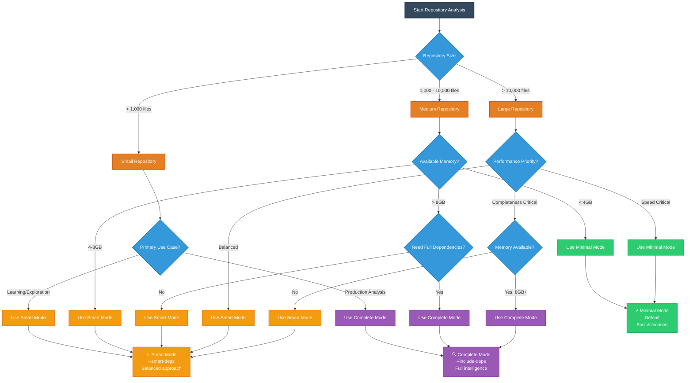

# Large Repository Handling Guide

This guide explains how to handle large repositories with the CodeCodePrism MCP server, including memory management, filtering options, and performance optimization.

## New Improved Defaults ✨

**Good news!** The MCP server now has much better defaults based on real-world usage:

- **Memory limit**: 4GB (was 1GB)
- **Batch size**: 30 files (was 50, optimized for memory efficiency)
- **File filtering**: Automatically includes common programming languages
- **Directory exclusion**: Common build/dependency directories excluded by default

This means for most repositories, you can simply run:
```bash
./target/release/codeprism-mcp /path/to/your/repository
```

## Default Configuration

### Memory & Performance
- **Memory limit**: 4GB (suitable for modern development machines)
- **Batch size**: 30 files (optimized balance of speed and memory usage)
- **Streaming mode**: Automatically enabled for repositories with >10,000 files

### File Filtering (New Defaults)
**Excluded directories** (automatic):
- **Version Control**: `.git`
- **Package Management**: `node_modules`, `vendor`
- **Build Artifacts**: `target`, `build`, `dist`, `coverage`
- **Python Virtual Environments**: `.venv`, `venv`, `.tox`, `.env`, `env`
- **Python Caches**: `__pycache__`, `.pytest_cache`, `.mypy_cache`, `.ruff_cache`
- **Web Build Artifacts**: `.next`, `.nuxt`
- **IDE/Editor**: `.vscode`, `.idea`
- **OS Files**: `.DS_Store`, `Thumbs.db`

**Included file extensions** (automatic):
- **Web**: `js`, `ts`, `jsx`, `tsx`
- **Systems**: `rs`, `c`, `cpp`, `h`, `hpp`, `go`
- **Enterprise**: `java`, `kt`, `swift`
- **Scripting**: `py`, `rb`, `php`

## When to Override Defaults

### Dependency Analysis Options

**New feature! 🎯** You can now control how dependencies are handled:

#### Decision Tree: Choose Your Dependency Mode



#### 1. Minimal (Default) - Fast but Limited
```bash
./target/release/codeprism-mcp /path/to/repo
```
- **Excludes**: All dependency directories (`.tox`, `venv`, `node_modules`, etc.)
- **Pros**: Fast indexing, low memory usage, focuses on your code
- **Cons**: Can't follow imports into dependencies, missing external API intelligence

#### 2. Smart Dependency Scanning - Balanced
```bash
./target/release/codeprism-mcp --smart-deps /path/to/repo
```
- **Includes**: Public APIs and commonly used dependency files only
- **Excludes**: Internal implementation details, tests, documentation
- **Includes**: `__init__.py`, `index.js`, `lib.rs`, top-level modules
- **Excludes**: `*/tests/`, `*/internal/`, `*/_private/`, deep nested files
- **Best for**: Following imports while keeping performance reasonable

#### 3. Complete Analysis - Comprehensive but Slow
```bash
./target/release/codeprism-mcp --include-deps /path/to/repo
```
- **Includes**: Everything including full dependency source code
- **Pros**: Complete code intelligence, full import following, comprehensive analysis
- **Cons**: Much slower indexing, high memory usage, may hit memory limits

### Comparison Examples

**Your specific use case**: Following imports in your `Agent` class

```python
# Your code can now follow these imports in smart mode:
from rustic_ai.core.agents.commons.message_formats import ErrorMessage  ✅
from pydantic import BaseModel  ✅ (public API)
from some_lib.internal._private import InternalHelper  ❌ (excluded in smart mode)
```

### Recommended Approach

1. **Start with smart mode** for most development:
```bash
./target/release/codeprism-mcp --smart-deps --memory-limit 4096 /path/to/repo
```

2. **Use complete analysis** when you need full dependency intelligence:
```bash
./target/release/codeprism-mcp --include-deps --memory-limit 8192 /path/to/repo
```

3. **Use minimal mode** for CI/CD or when performance is critical:
```bash
./target/release/codeprism-mcp /path/to/repo  # Default
```

### Very Large Repositories (>50,000 files)
```bash
./target/release/codeprism-mcp --memory-limit 8192 --batch-size 20 /path/to/huge/repo
```

### Specific Language Focus
```bash
# Only Python and JavaScript
./target/release/codeprism-mcp --include-extensions py,js,ts /path/to/repo

# Only Rust projects  
./target/release/codeprism-mcp --include-extensions rs,toml /path/to/repo
```

### Memory-Constrained Systems
```bash
# For systems with limited RAM
./target/release/codeprism-mcp --memory-limit 2048 --batch-size 15 /path/to/repo
```

### Include All File Types
```bash
# Override defaults to include all files (not recommended for large repos)
./target/release/codeprism-mcp --include-extensions "*" /path/to/repo
```

## Command Line Options Reference

| Option | **New Default** | Description |
|--------|---------|-------------|
| `--memory-limit MB` | **4096** | Memory limit in MB |
| `--batch-size SIZE` | **30** | Files processed in parallel |
| `--max-file-size MB` | 10 | Skip files larger than this |
| `--exclude-dirs DIRS` | **Smart defaults** | Comma-separated directories to exclude |
| `--include-extensions EXTS` | **Programming languages** | Comma-separated file extensions |
| `--disable-memory-limit` | false | Disable memory checking |
| `--verbose` | false | Enable verbose logging |

### Default Excluded Directories
- `.git`, `node_modules`, `target`, `.venv`, `__pycache__`, `build`, `dist`, `vendor`
- `.tox`, `venv`, `.env`, `env`, `.pytest_cache`, `.mypy_cache`, `.ruff_cache`
- `.next`, `.nuxt`, `coverage`, `.coverage`, `.vscode`, `.idea`, `.DS_Store`, `Thumbs.db`

### Default Included Extensions  
- `py`, `js`, `ts`, `jsx`, `tsx`, `rs`, `java`, `cpp`, `c`, `h`, `hpp`, `go`, `php`, `rb`, `kt`, `swift`

## Migration from Old Defaults

If you were using the old defaults and want to include all file types like before:

```bash
# Old behavior (include all files, 1GB limit)
./target/release/codeprism-mcp --memory-limit 1024 --include-extensions "*" /path/to/repo
```

## Examples

### Simple Usage (Recommended)
```bash
# Uses optimized defaults - works for most repositories
./target/release/codeprism-mcp /path/to/your/repository
```

### Custom Configuration Examples
```bash
# Minimal memory usage
./target/release/codeprism-mcp --memory-limit 1024 --batch-size 15

# Maximum performance (if you have lots of RAM)
./target/release/codeprism-mcp --memory-limit 16384 --batch-size 50

# Disable memory limits entirely
./target/release/codeprism-mcp --disable-memory-limit
```

The new defaults should handle most real-world repositories without any configuration needed! 