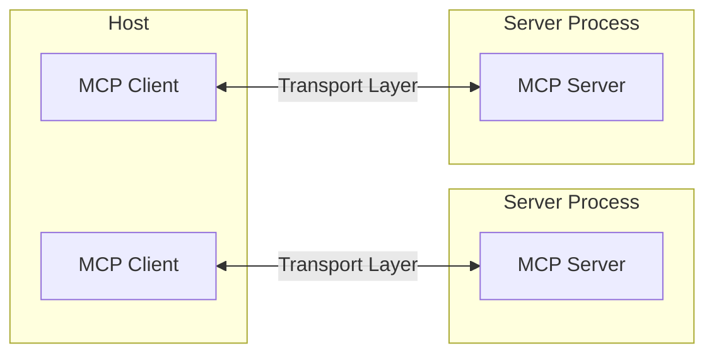
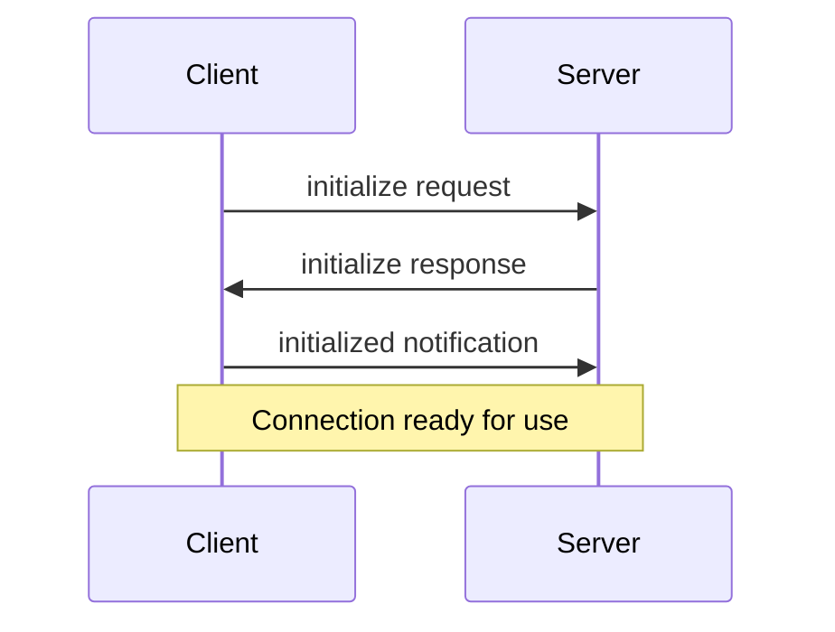

# Model Context Protocol (MCP) - Complete Documentation
*Downloaded from https://modelcontextprotocol.io/llms-full.txt*

## Example Clients

A list of applications that support MCP integrations. This page provides an overview of applications that support the Model Context Protocol (MCP). Each client may support different MCP features, allowing for varying levels of integration with MCP servers.

## Feature Support Matrix

| Client | Resources | Prompts | Tools | Discovery | Sampling | Roots | Notes |
|--------|-----------|---------|-------|-----------|----------|-------|-------|
| Claude Desktop App | ✅ | ✅ | ✅ | ❌ | ❌ | ❌ | Supports tools, prompts, and resources for local and remote MCP servers |
| Cursor | ❌ | ❌ | ✅ | ❌ | ❌ | ❌ | Supports tools |
| Cline | ✅ | ❌ | ✅ | ✅ | ❌ | ❌ | Supports tools and resources |
| Continue | ✅ | ✅ | ✅ | ❓ | ❌ | ❌ | Supports tools, prompts, and resources |
| VS Code GitHub Copilot | ✅ | ✅ | ✅ | ✅ | ✅ | ✅ | Supports dynamic tool/roots discovery, secure secret configuration |

*Note: This is a subset of the full compatibility matrix. See the complete list at https://modelcontextprotocol.io/clients*

## Core Architecture

MCP follows a client-server architecture where:
- **Hosts** are LLM applications (like Claude Desktop or IDEs) that initiate connections
- **Clients** maintain 1:1 connections with servers, inside the host application  
- **Servers** provide context, tools, and prompts to clients



## Protocol Components

### Resources
Resources expose data and content from your servers to LLMs. Resources are designed to be **application-controlled**, meaning that the client application can decide how and when they should be used.

Key features:
- **Text resources**: UTF-8 encoded text data (source code, configs, logs, JSON/XML data)
- **Binary resources**: Raw binary data encoded in base64 (images, PDFs, audio, video)
- **Resource discovery**: Through `resources/list` endpoint
- **Resource templates**: URI templates for dynamic resources
- **Real-time updates**: Via subscription mechanisms

### Tools
Tools enable LLMs to perform actions through your server. Tools are designed to be **model-controlled**, meaning they are exposed with the intention of the AI model being able to automatically invoke them.

Key capabilities:
- **Discovery**: Clients list available tools through `tools/list` endpoint
- **Invocation**: Tools called using `tools/call` endpoint
- **Flexibility**: Range from simple calculations to complex API interactions
- **Annotations**: Metadata about tool behavior (readOnly, destructive, idempotent hints)

### Prompts
Prompts enable servers to define reusable prompt templates and workflows that clients can surface to users and LLMs. They are designed to be **user-controlled**.

Features:
- Accept dynamic arguments
- Include context from resources  
- Chain multiple interactions
- Guide specific workflows
- Surface as UI elements (slash commands)

### Sampling
Sampling allows servers to request LLM completions through the client, enabling sophisticated agentic behaviors while maintaining security and privacy.

The sampling flow:
1. Server sends `sampling/createMessage` request to client
2. Client reviews and can modify the request
3. Client samples from an LLM
4. Client reviews the completion
5. Client returns result to server

## Transport Mechanisms

### Standard Input/Output (stdio)
- Uses standard input/output streams
- Ideal for local integrations and command-line tools
- Simple process communication

### Streamable HTTP
- HTTP POST requests for client-to-server communication
- Optional Server-Sent Events (SSE) for server-to-client communication
- Supports stateful sessions and resumability
- Web-based integrations

## Security Considerations

### Key Principles
1. **User Consent and Control**: Users must explicitly consent to all data access and operations
2. **Data Privacy**: Explicit user consent required before exposing user data to servers
3. **Tool Safety**: Tools represent arbitrary code execution and must be treated with caution
4. **LLM Sampling Controls**: Users must explicitly approve any LLM sampling requests

### Implementation Guidelines
- Build robust consent and authorization flows
- Provide clear documentation of security implications
- Implement appropriate access controls and data protections
- Follow security best practices in integrations

## Message Format

MCP uses JSON-RPC 2.0 as its wire format with three types of messages:

### Requests
```typescript
{
  jsonrpc: "2.0",
  id: number | string,
  method: string,
  params?: object
}
```

### Responses
```typescript
{
  jsonrpc: "2.0", 
  id: number | string,
  result?: object,
  error?: {
    code: number,
    message: string,
    data?: unknown
  }
}
```

### Notifications
```typescript
{
  jsonrpc: "2.0",
  method: string,
  params?: object
}
```

## Connection Lifecycle

### 1. Initialization


### 2. Message Exchange
After initialization:
- **Request-Response**: Client or server sends requests, the other responds
- **Notifications**: Either party sends one-way messages

### 3. Termination
- Clean shutdown via `close()`
- Transport disconnection
- Error conditions

## Implementation Best Practices

### For Resources
1. Use clear, descriptive resource names and URIs
2. Include helpful descriptions for LLM understanding
3. Set appropriate MIME types when known
4. Implement resource templates for dynamic content
5. Use subscriptions for frequently changing resources

### For Tools
1. Provide clear, descriptive names and descriptions
2. Use detailed JSON Schema definitions for parameters
3. Include examples in tool descriptions
4. Implement proper error handling and validation
5. Use progress reporting for long operations

### For Prompts
1. Use clear, descriptive prompt names
2. Provide detailed descriptions for prompts and arguments
3. Validate all required arguments
4. Handle missing arguments gracefully
5. Consider versioning for prompt templates

## Error Handling

MCP defines standard error codes:
```typescript
enum ErrorCode {
  ParseError = -32700,
  InvalidRequest = -32600,
  MethodNotFound = -32601,
  InvalidParams = -32602,
  InternalError = -32603,
}
```

## Debugging and Monitoring

### Development Tools
- **MCP Inspector**: Interactive tool for testing and debugging servers
- **Logging**: Structured logging for protocol events and errors
- **Chrome DevTools**: For client-side debugging in applications like Claude Desktop

### Best Practices
1. **Structured Logging**: Consistent formats with context and timestamps
2. **Error Handling**: Log stack traces and error context
3. **Performance Tracking**: Monitor operation timing and resource usage
4. **Security Considerations**: Sanitize logs and protect credentials

## Getting Started

### For Server Development
1. Choose your SDK (TypeScript, Python, etc.)
2. Define your server capabilities (resources, tools, prompts)
3. Implement request handlers
4. Test with MCP Inspector
5. Deploy and configure with clients

### For Client Integration
1. Implement MCP client using SDKs
2. Handle server discovery and connection
3. Implement UI for user consent and control
4. Test with existing MCP servers
5. Deploy with proper security measures

## Community and Ecosystem

- **GitHub Organization**: https://github.com/modelcontextprotocol
- **Official SDKs**: TypeScript, Python, and more
- **Community Servers**: Hundreds of implementations available
- **Documentation**: Comprehensive guides and examples
- **Support Channels**: GitHub Discussions and Issues

---

*This documentation provides a comprehensive overview of the Model Context Protocol. For the latest updates and detailed technical specifications, visit https://modelcontextprotocol.io*

---

## CodePrism MCP Server Examples

### CodePrism Tool Usage

CodePrism implements 23 production-ready MCP tools. Here are example JSON-RPC requests and responses:

#### Repository Analysis
```json
// Request: Get repository statistics
{
  "jsonrpc": "2.0",
  "id": 1,
  "method": "tools/call",
  "params": {
    "name": "repository_stats",
    "arguments": {}
  }
}

// Response
{
  "jsonrpc": "2.0",
  "id": 1,
  "result": {
    "content": [
      {
        "type": "text",
        "text": "{\"total_nodes\": 2575, \"total_edges\": 2999, \"total_files\": 22, \"nodes_by_kind\": {\"call\": 1145, \"class\": 284, \"function\": 28}}"
      }
    ],
    "isError": false
  }
}
```

#### Symbol Search
```json
// Request: Search for User symbols
{
  "jsonrpc": "2.0",
  "id": 2,
  "method": "tools/call",
  "params": {
    "name": "search_symbols",
    "arguments": {
      "pattern": "User",
      "limit": 5
    }
  }
}

// Response includes symbol IDs, names, files, and context
{
  "jsonrpc": "2.0",
  "id": 2,
  "result": {
    "content": [
      {
        "type": "text",
        "text": "{\"pattern\": \"User\", \"results\": [{\"id\": \"caef2cadc8c519e73938f83ae0e23c69\", \"name\": \"UserUpdatedEvent\", \"kind\": \"Class\", \"file\": \"./models/user.py\"}]}"
      }
    ],
    "isError": false
  }
}
```

#### Security Analysis (Production Milestone 2 Tool)
```json
// Request: Analyze security vulnerabilities
{
  "jsonrpc": "2.0",
  "id": 3,
  "method": "tools/call",
  "params": {
    "name": "analyze_security",
    "arguments": {
      "vulnerability_types": ["injection", "authentication"],
      "severity_threshold": "medium"
    }
  }
}

// Response with vulnerability assessment
{
  "jsonrpc": "2.0",
  "id": 3,
  "result": {
    "content": [
      {
        "type": "text",
        "text": "{\"analysis_metadata\": {\"total_files_scanned\": 22, \"analysis_errors\": 0}, \"vulnerability_types\": [\"injection\", \"authentication\"], \"severity_threshold\": \"medium\"}"
      }
    ],
    "isError": false
  }
}
```

#### Batch Analysis
```json
// Request: Execute multiple tools in parallel
{
  "jsonrpc": "2.0",
  "id": 4,
  "method": "tools/call",
  "params": {
    "name": "batch_analysis",
    "arguments": {
      "tool_calls": [
        {"tool_name": "repository_stats"},
        {"tool_name": "content_stats"},
        {"tool_name": "find_unused_code", "parameters": {"confidence_threshold": 0.9}}
      ],
      "execution_strategy": "parallel",
      "merge_results": true
    }
  }
}

// Response with aggregated results
{
  "jsonrpc": "2.0",
  "id": 4,
  "result": {
    "content": [
      {
        "type": "text",
        "text": "{\"batch_summary\": {\"execution_strategy\": \"parallel\", \"status\": \"completed\", \"total_tools\": 3}, \"individual_results\": [...], \"optimization_suggestions\": [\"Consider parallel execution for analysis tools\"]}"
      }
    ],
    "isError": false
  }
}
```

#### Tool Listing
```json
// Request: List all available tools
{
  "jsonrpc": "2.0",
  "id": 5,
  "method": "tools/list",
  "params": {}
}

// Response: 23 tools with schemas
{
  "jsonrpc": "2.0",
  "id": 5,
  "result": {
    "tools": [
      {
        "name": "repository_stats",
        "description": "Get comprehensive statistics about the repository",
        "inputSchema": {
          "type": "object",
          "properties": {},
          "required": []
        }
      },
      {
        "name": "find_unused_code",
        "description": "Identify unused functions, classes, variables, and imports",
        "inputSchema": {
          "type": "object",
          "properties": {
            "analyze_types": {
              "type": "array",
              "items": {"enum": ["functions", "classes", "variables", "imports", "all"]},
              "default": ["functions", "classes", "variables", "imports"]
            },
            "confidence_threshold": {
              "type": "number",
              "minimum": 0.0,
              "maximum": 1.0,
              "default": 0.7
            }
          }
        }
      }
      // ... 21 more tools
    ]
  }
}
```

### Server Configuration

#### Environment Setup
```bash
# Set repository path
export REPOSITORY_PATH=/path/to/your/repository

# Start CodePrism MCP server
./target/release/codeprism-mcp
```

#### Client Configuration (Claude Desktop)
```json
{
  "mcpServers": {
    "codeprism": {
      "command": "./target/release/codeprism-mcp",
      "env": {
        "REPOSITORY_PATH": "/path/to/repository"
      }
    }
  }
}
```

### Tool Categories

**Core Navigation & Understanding (4 tools):**
- `repository_stats`, `explain_symbol`, `trace_path`, `find_dependencies`

**Search & Discovery (4 tools):**
- `search_symbols`, `search_content`, `find_files`, `content_stats`

**Analysis Tools (11 tools):**
- Production Milestone 2: `find_unused_code`, `analyze_security`, `analyze_performance`, `analyze_api_surface`
- Core Analysis: `analyze_complexity`, `trace_data_flow`, `analyze_transitive_dependencies`, `detect_patterns`, `trace_inheritance`, `analyze_decorators`, `find_duplicates`

**Workflow & Orchestration (4 tools):**
- `suggest_analysis_workflow`, `batch_analysis`, `optimize_workflow`, `find_references`

### Error Handling
```json
// Error response example
{
  "jsonrpc": "2.0",
  "id": 6,
  "result": {
    "content": [
      {
        "type": "text",
        "text": "{\"error\": \"Symbol not found\", \"suggestion\": \"Check if the symbol name is correct or try using a different identifier\", \"target\": \"invalid_symbol_id\"}"
      }
    ],
    "isError": false
  }
}
```

The CodePrism MCP server provides comprehensive code intelligence through 23 production-ready tools, all verified to be working correctly with 100% success rate in testing. 