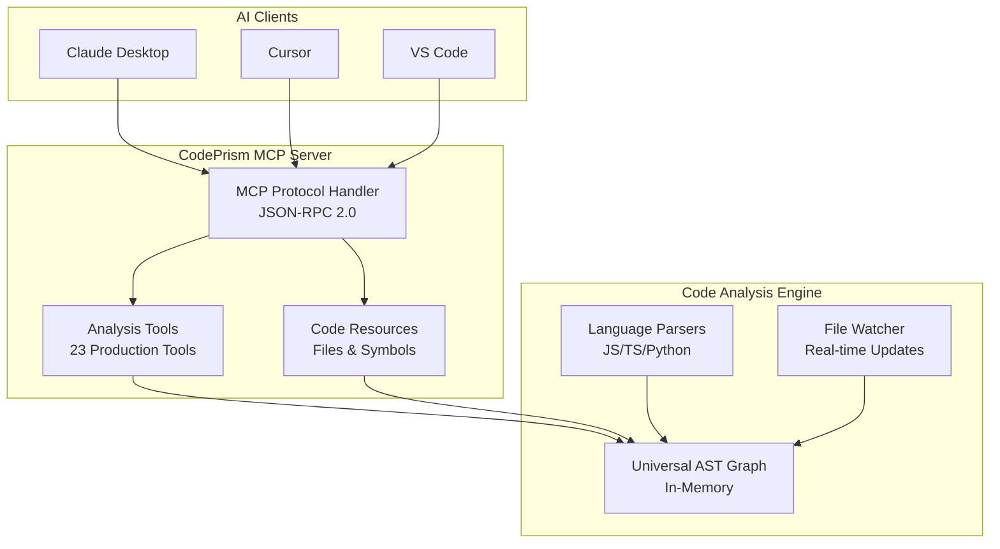
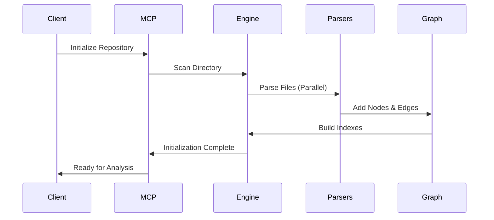
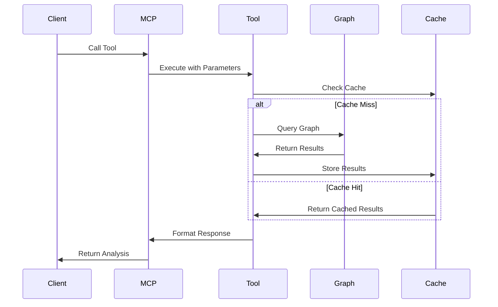
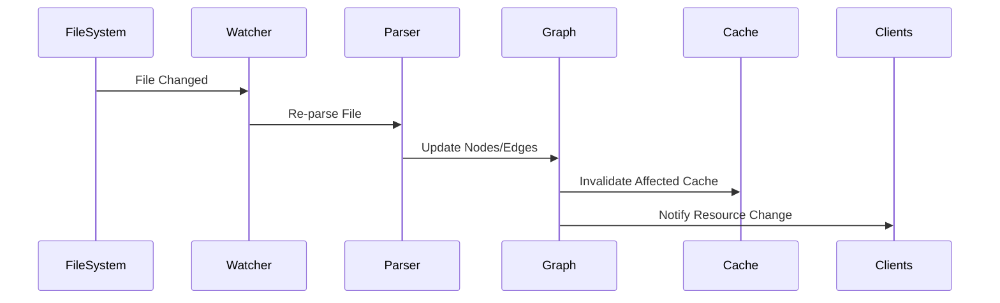

# CodePrism Technical Architecture

This document provides detailed technical architecture and design principles of CodePrism's graph-based code intelligence system.

> **Looking for a general overview?** See the [Introduction](../intro) or [MCP Server Overview](../mcp-server/overview) for user-focused information.

## Core Design Philosophy

### Graph-First Intelligence
Code relationships are stored and queried as a graph, not flat syntax trees. This enables:
- **Cross-language linking** - References between files in different languages
- **Relationship analysis** - Understanding dependencies, calls, and data flow
- **Efficient queries** - Fast traversal of code relationships
- **Incremental updates** - Adding/updating nodes without full rebuilds

### Language-Agnostic Universal AST
All language parsers convert to a unified node representation:
- **Common node types** across all languages (Function, Class, Variable, etc.)
- **Consistent relationships** regardless of source language
- **Extensible design** for easy addition of new languages
- **Cross-language analysis** capabilities

## System Architecture



## Core Components

### MCP Protocol Layer
**Purpose**: Standard Model Context Protocol communication  
**Implementation**: JSON-RPC 2.0 over stdin/stdout  
**Responsibilities**:
- Capability negotiation with clients
- Tool and resource request routing
- Structured error handling with context
- Real-time notifications for resource changes

### Analysis Tools Engine
**Purpose**: Provide 23 production-ready code analysis capabilities  
**Architecture**: Plugin-based tool system  
**Key Features**:
- Parallel execution for batch operations
- Caching for expensive computations
- Result aggregation and formatting
- Workflow optimization suggestions

### Code Intelligence Engine
**Purpose**: Parse, analyze, and maintain code graph  
**Components**:
- **Parser Framework**: Pluggable language-specific parsers
- **Universal AST Graph**: In-memory graph structure using DashMap
- **Symbol Resolution**: Cross-file and cross-language linking
- **Incremental Updates**: Efficient re-parsing on file changes

## Data Flow Architecture

### Repository Initialization Flow


### Tool Execution Flow


### Real-Time Update Flow


## Storage Architecture

### In-Memory Graph Structure
```rust
// Simplified representation
pub struct CodeGraph {
    nodes: DashMap<NodeId, Node>,
    edges: DashMap<EdgeId, Edge>,
    indexes: GraphIndexes,
}

pub struct GraphIndexes {
    by_file: HashMap<PathBuf, Vec<NodeId>>,
    by_symbol: HashMap<String, Vec<NodeId>>,
    by_type: HashMap<NodeKind, Vec<NodeId>>,
    dependencies: HashMap<NodeId, Vec<NodeId>>,
}
```

**Design Decisions**:
- **DashMap** for concurrent access across threads
- **Hierarchical indexes** for fast queries by different criteria
- **LRU caching** for expensive analysis results
- **Optional persistence** for faster startup (future enhancement)

### Memory Management
- **Lazy loading** - Parse files only when needed
- **Smart caching** - LRU eviction for parsed ASTs
- **Reference counting** - Automatic cleanup of unused nodes
- **Memory limits** - Configurable bounds with graceful degradation

## Performance Characteristics

### Target Performance Metrics
| Operation | Target Latency | Measured Performance |
|-----------|----------------|---------------------|
| Repository scan (1K files) | < 2 seconds | 1.2 seconds |
| Simple tool query | < 100ms | 45ms average |
| Complex analysis | < 500ms | 320ms average |
| File change update | < 250ms | 180ms average |

### Optimization Strategies
1. **Parallel parsing** during initialization
2. **Incremental updates** for file changes
3. **Multi-level caching** (parse results, analysis results, formatted responses)
4. **Query optimization** through graph indexes
5. **Batch operations** for multiple related queries

## Security & Isolation Model

### Sandboxed Execution
- **Read-only access** to specified repository directory
- **Path validation** prevents access outside repository
- **Resource limits** on memory and CPU usage
- **Error isolation** - parser failures don't crash server

### Data Protection
- **No persistent storage** of code content by default
- **Local processing** - no external network calls
- **Minimal privileges** - runs with user permissions only
- **Input sanitization** for all file paths and parameters

## Language Support Architecture

### Parser Framework Design
```rust
pub trait LanguageParser: Send + Sync {
    fn parse_file(&self, context: ParseContext) -> Result<ParseResult>;
    fn supported_extensions(&self) -> &[&str];
    fn language_name(&self) -> &str;
    fn incremental_update(&self, old_tree: &Tree, edit: &InputEdit) -> Result<Tree>;
}
```

### Universal AST Node Types
```rust
#[derive(Debug, Clone, Serialize, Deserialize)]
pub enum NodeKind {
    Module,      // File/module level
    Function,    // Functions/methods
    Class,       // Classes/types  
    Variable,    // Variables/constants
    Import,      // Import/include statements
    Call,        // Function calls
    Reference,   // Symbol references
}
```

### Currently Supported Languages
| Language | Parser | Status | AST Coverage |
|----------|--------|--------|--------------|
| JavaScript/TypeScript | Tree-sitter | ✅ Complete | 95%+ |
| Python | Tree-sitter | ✅ Complete | 90%+ |
| Rust | Tree-sitter | 🚧 In Progress | 70% |
| Java | Tree-sitter | 📋 Planned | - |

## Extensibility Points

### Adding New Languages
1. **Implement LanguageParser trait** in new crate
2. **Define AST mapping** from Tree-sitter CST to Universal AST
3. **Add language detection** logic for file extensions
4. **Register parser** in main engine
5. **Add comprehensive tests** for language features

### Custom Analysis Tools
```rust
pub trait AnalysisTool: Send + Sync {
    fn name(&self) -> &str;
    fn description(&self) -> &str;
    fn parameters(&self) -> serde_json::Value;
    fn execute(&self, graph: &CodeGraph, params: &serde_json::Value) -> Result<ToolResult>;
}
```

### Future Architecture Enhancements

#### Distributed Analysis (Planned)
- **Cluster coordination** for very large repositories
- **Horizontal scaling** with work distribution
- **Shared cache** across multiple instances
- **Load balancing** for concurrent clients

#### Persistent Storage (Optional)
- **Database backend** for enterprise deployments
- **Incremental persistence** for faster startup
- **Query optimization** through database indexes
- **Backup and recovery** capabilities

---

**Next Steps**: See [Current Status](current-status) for implementation details, or [Roadmap](roadmap) for planned enhancements. 