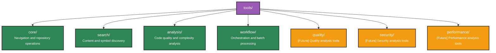

# CodePrism MCP Server - Future Roadmap

## Current Status

**✅ Production Ready**: The CodePrism MCP server is fully functional with 23 production-ready tools covering all core code analysis needs.

## Potential Future Enhancements

### 🔍 **Additional Quality Analysis Tools**

#### Code Quality Tools
- **`find_duplicates`** - Code duplication detection and similarity analysis
- **`find_unused_code`** - Dead code elimination and unused symbol detection  
- **`analyze_code_smells`** - Anti-pattern detection and code smell identification

#### Security Analysis Tools
- **`analyze_security`** - Security vulnerability scanning and risk assessment
- **`analyze_dependencies`** - Third-party dependency security analysis
- **`scan_secrets`** - Hardcoded credentials and sensitive data detection

#### Performance Analysis Tools
- **`analyze_performance`** - Performance bottleneck identification and optimization suggestions
- **`profile_complexity`** - Algorithmic complexity analysis and performance profiling
- **`analyze_memory_usage`** - Memory usage patterns and potential leak detection

### 🌐 **Language Support Expansion**

#### Additional Language Parsers
- **Rust Parser** - Complete Rust AST parsing and analysis
- **Java Parser** - Java/Kotlin codebase analysis
- **Go Parser** - Go language support
- **C/C++ Parser** - Systems programming language support

#### Enhanced Language Features
- **Cross-Language Analysis** - Polyglot codebase understanding
- **Language Interop** - FFI and bindings analysis
- **Build System Integration** - Cargo, Maven, Gradle integration

### 🔧 **Advanced Analysis Features**

#### Dynamic Behavior Analysis
- **Runtime Profiling Integration** - Connect static analysis with runtime profiling data
- **Test Coverage Integration** - Link analysis with test coverage reports
- **Configuration Analysis** - Environment and configuration dependency analysis

#### Architecture & Design
- **Architectural Metrics** - SOLID principles analysis and architectural health scoring
- **Design Pattern Recommendations** - AI-powered refactoring suggestions
- **Technical Debt Quantification** - Automated technical debt scoring and prioritization

### 🎯 **Integration & Usability**

#### Developer Experience
- **IDE Integrations** - VS Code, IntelliJ, Vim/Neovim plugins
- **CI/CD Integration** - GitHub Actions, GitLab CI pipeline integration
- **Diff Analysis** - Git diff-aware analysis for code review assistance

#### Advanced Workflows
- **Automated Refactoring** - Safe refactoring suggestions and automation
- **Code Generation** - Template-based code generation from analysis
- **Documentation Generation** - Automated documentation from code analysis

### 📊 **Analytics & Reporting**

#### Metrics Dashboard
- **Code Health Dashboard** - Real-time repository health monitoring
- **Trend Analysis** - Code quality trends over time
- **Team Analytics** - Developer productivity and code quality metrics

#### Export & Integration
- **Report Generation** - PDF/HTML report generation for stakeholders
- **Metrics API** - REST API for custom integrations
- **Webhook Integration** - Real-time notifications for quality gates

## Implementation Priorities

### High Priority (If Requested)
1. **Additional Language Support** - Rust and Java parsers
2. **Code Quality Tools** - Duplicate detection and unused code analysis
3. **Security Analysis** - Basic vulnerability scanning

### Medium Priority
1. **Performance Analysis Tools** - Bottleneck detection
2. **Advanced Architecture Analysis** - Design pattern analysis
3. **CI/CD Integration** - Pipeline integration

### Low Priority
1. **Advanced Reporting** - Dashboard and analytics
2. **IDE Integrations** - Editor plugins
3. **Advanced AI Features** - ML-powered analysis

## Contributing

The current 23-tool implementation provides comprehensive code analysis capabilities. Future enhancements will be driven by:

- **User feedback** and specific use case requirements
- **Community contributions** and feature requests  
- **Integration needs** with specific development workflows
- **Language ecosystem** support requirements

### Contribution Areas
- **New language parsers** using the extensible parser framework
- **Additional analysis algorithms** for quality and security tools
- **Integration adapters** for CI/CD and development tools
- **Documentation and examples** for specific use cases

## Architecture for Extensions

The current modular architecture supports easy extension:

Each new tool category can be developed independently while leveraging the existing:
- **Graph-based code representation**
- **Multi-language parser framework**  
- **MCP protocol implementation**
- **Resource and prompt systems**

## Conclusion

The CodePrism MCP server is **production-ready** for immediate use. Future enhancements will focus on expanding analysis capabilities based on real-world usage patterns and community feedback.

The current 23 tools provide a solid foundation for:
- ✅ **Code exploration and navigation**
- ✅ **Architecture understanding**  
- ✅ **Dependency analysis**
- ✅ **Python-specific metaprogramming analysis**
- ✅ **Workflow orchestration and automation**

Future development will be **community-driven** and **use-case specific** rather than speculative feature development. 