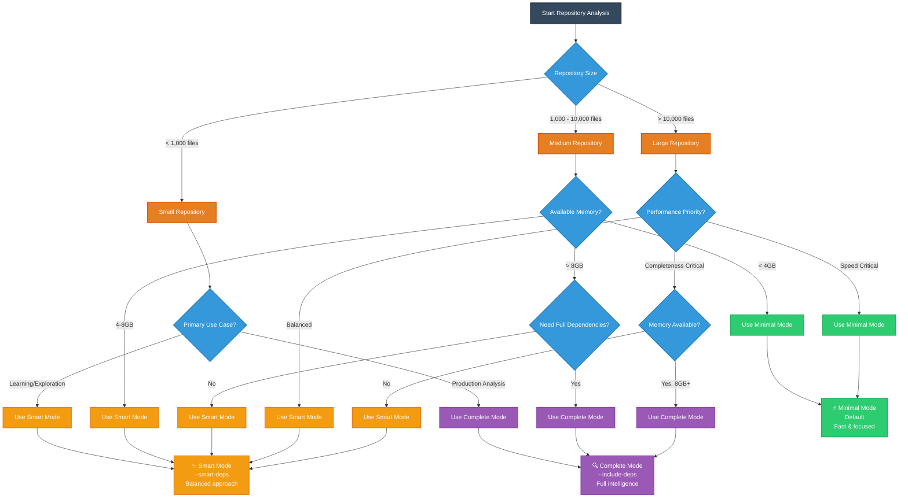

# Large Repository Handling Guide

This guide explains how to handle large repositories with the CodePrism MCP server, including memory management, filtering options, and performance optimization.

## New Improved Defaults ✨

**Good news!** The MCP server now has much better defaults based on real-world usage:

- **Memory limit**: 4GB (was 1GB)
- **Batch size**: 30 files (was 50, optimized for memory efficiency)
- **File filtering**: Automatically includes common programming languages
- **Directory exclusion**: Common build/dependency directories excluded by default

This means for most repositories, you can simply run:
```bash
export CODEPRISM_PROFILE=development
export REPOSITORY_PATH=/path/to/your/repository
./target/release/codeprism-mcp-server
```

## Default Configuration

### Memory & Performance
- **Memory limit**: 4GB (suitable for modern development machines)
- **Batch size**: 30 files (optimized balance of speed and memory usage)
- **Streaming mode**: Automatically enabled for repositories with >10,000 files

### File Filtering (New Defaults)
**Excluded directories** (automatic):
- **Version Control**: `.git`
- **Package Management**: `node_modules`, `vendor`
- **Build Artifacts**: `target`, `build`, `dist`, `coverage`
- **Python Virtual Environments**: `.venv`, `venv`, `.tox`, `.env`, `env`
- **Python Caches**: `__pycache__`, `.pytest_cache`, `.mypy_cache`, `.ruff_cache`
- **Web Build Artifacts**: `.next`, `.nuxt`
- **IDE/Editor**: `.vscode`, `.idea`
- **OS Files**: `.DS_Store`, `Thumbs.db`

**Included file extensions** (automatic):
- **Web**: `js`, `ts`, `jsx`, `tsx`
- **Systems**: `rs`, `c`, `cpp`, `h`, `hpp`, `go`
- **Enterprise**: `java`, `kt`, `swift`
- **Scripting**: `py`, `rb`, `php`

## When to Override Defaults

### Dependency Analysis Options

**New feature! 🎯** You can now control how dependencies are handled:

#### Decision Tree: Choose Your Dependency Mode



#### 1. Minimal (Default) - Fast but Limited
```bash
export CODEPRISM_PROFILE=development
export REPOSITORY_PATH=/path/to/repo
./target/release/codeprism-mcp-server
```
- **Excludes**: All dependency directories (`.tox`, `venv`, `node_modules`, etc.)
- **Pros**: Fast indexing, low memory usage, focuses on your code
- **Cons**: Can't follow imports into dependencies, missing external API intelligence

#### 2. Smart Dependency Scanning - Balanced
```bash
export CODEPRISM_PROFILE=development
export CODEPRISM_DEPENDENCY_MODE=smart
export REPOSITORY_PATH=/path/to/repo
./target/release/codeprism-mcp-server
```
- **Includes**: Public APIs and commonly used dependency files only
- **Excludes**: Internal implementation details, tests, documentation
- **Includes**: `__init__.py`, `index.js`, `lib.rs`, top-level modules
- **Excludes**: `*/tests/`, `*/internal/`, `*/_private/`, deep nested files
- **Best for**: Following imports while keeping performance reasonable

#### 3. Complete Analysis - Comprehensive but Slow
```bash
export CODEPRISM_PROFILE=production
export CODEPRISM_DEPENDENCY_MODE=include_all
export REPOSITORY_PATH=/path/to/repo
./target/release/codeprism-mcp-server
```
- **Includes**: Everything including full dependency source code
- **Pros**: Complete code intelligence, full import following, comprehensive analysis
- **Cons**: Much slower indexing, high memory usage, may hit memory limits

### Comparison Examples

**Your specific use case**: Following imports in your `Agent` class

```python
# Your code can now follow these imports in smart mode:
from rustic_ai.core.agents.commons.message_formats import ErrorMessage  ✅
from pydantic import BaseModel  ✅ (public API)
from some_lib.internal._private import InternalHelper  ❌ (excluded in smart mode)
```

### Recommended Approach

1. **Start with smart mode** for most development:
```bash
export CODEPRISM_PROFILE=development
export CODEPRISM_MEMORY_LIMIT_MB=4096
export CODEPRISM_DEPENDENCY_MODE=smart
export REPOSITORY_PATH=/path/to/repo
./target/release/codeprism-mcp-server
```

2. **Use complete analysis** when you need full dependency intelligence:
```bash
export CODEPRISM_PROFILE=production
export CODEPRISM_MEMORY_LIMIT_MB=8192
export CODEPRISM_DEPENDENCY_MODE=include_all
export REPOSITORY_PATH=/path/to/repo
./target/release/codeprism-mcp-server
```

3. **Use minimal mode** for CI/CD or when performance is critical:
```bash
export CODEPRISM_PROFILE=development
export REPOSITORY_PATH=/path/to/repo
./target/release/codeprism-mcp-server  # Default
```

### Very Large Repositories (>50,000 files)
```bash
export CODEPRISM_PROFILE=enterprise
export CODEPRISM_MEMORY_LIMIT_MB=8192
export CODEPRISM_BATCH_SIZE=20
export REPOSITORY_PATH=/path/to/huge/repo
./target/release/codeprism-mcp-server
```

### Specific Language Focus
```bash
# Only Python and JavaScript
export CODEPRISM_PROFILE=development
export CODEPRISM_INCLUDE_EXTENSIONS="py,js,ts"
export REPOSITORY_PATH=/path/to/repo
./target/release/codeprism-mcp-server

# Only Rust projects  
export CODEPRISM_PROFILE=development
export CODEPRISM_INCLUDE_EXTENSIONS="rs,toml"
export REPOSITORY_PATH=/path/to/repo
./target/release/codeprism-mcp-server
```

### Memory-Constrained Systems
```bash
# For systems with limited RAM
export CODEPRISM_PROFILE=development
export CODEPRISM_MEMORY_LIMIT_MB=2048
export CODEPRISM_BATCH_SIZE=15
export REPOSITORY_PATH=/path/to/repo
./target/release/codeprism-mcp-server
```

### Include All File Types
```bash
# Override defaults to include all files (not recommended for large repos)
export CODEPRISM_PROFILE=development
export CODEPRISM_INCLUDE_EXTENSIONS="*"
export REPOSITORY_PATH=/path/to/repo
./target/release/codeprism-mcp-server
```

## Environment Variables Reference

| Environment Variable | **Default** | Description |
|--------|---------|-------------|
| `CODEPRISM_PROFILE` | **development** | Configuration profile (development/production/enterprise) |
| `CODEPRISM_MEMORY_LIMIT_MB` | **4096** | Memory limit in MB |
| `CODEPRISM_BATCH_SIZE` | **30** | Files processed in parallel |
| `CODEPRISM_MAX_FILE_SIZE_MB` | **10** | Skip files larger than this |
| `CODEPRISM_EXCLUDE_DIRS` | **Smart defaults** | Comma-separated directories to exclude |
| `CODEPRISM_INCLUDE_EXTENSIONS` | **Programming languages** | Comma-separated file extensions |
| `CODEPRISM_DEPENDENCY_MODE` | **minimal** | Dependency analysis mode (minimal/smart/include_all) |
| `REPOSITORY_PATH` | **Required** | Path to repository to analyze |
| `RUST_LOG` | **info** | Logging level (debug/info/warn/error) |

### Default Excluded Directories
- `.git`, `node_modules`, `target`, `.venv`, `__pycache__`, `build`, `dist`, `vendor`
- `.tox`, `venv`, `.env`, `env`, `.pytest_cache`, `.mypy_cache`, `.ruff_cache`
- `.next`, `.nuxt`, `coverage`, `.coverage`, `.vscode`, `.idea`, `.DS_Store`, `Thumbs.db`

### Default Included Extensions  
- `py`, `js`, `ts`, `jsx`, `tsx`, `rs`, `java`, `cpp`, `c`, `h`, `hpp`, `go`, `php`, `rb`, `kt`, `swift`

## Migration from Old Command-Line Interface

If you were using the old command-line interface, here's how to migrate:

```bash
# Old command-line approach
# ./target/release/codeprism-mcp --memory-limit 1024 --include-extensions "*" /path/to/repo

# New environment variable approach
export CODEPRISM_PROFILE=development
export CODEPRISM_MEMORY_LIMIT_MB=1024
export CODEPRISM_INCLUDE_EXTENSIONS="*"
export REPOSITORY_PATH=/path/to/repo
./target/release/codeprism-mcp-server
```

## Examples

### Simple Usage (Recommended)
```bash
# Uses optimized defaults - works for most repositories
export CODEPRISM_PROFILE=development
export REPOSITORY_PATH=/path/to/your/repository
./target/release/codeprism-mcp-server
```

### Custom Configuration Examples
```bash
# Minimal memory usage
export CODEPRISM_PROFILE=development
export CODEPRISM_MEMORY_LIMIT_MB=1024
export CODEPRISM_BATCH_SIZE=15
export REPOSITORY_PATH=/path/to/repo
./target/release/codeprism-mcp-server

# Maximum performance (if you have lots of RAM)
export CODEPRISM_PROFILE=enterprise
export CODEPRISM_MEMORY_LIMIT_MB=16384
export CODEPRISM_BATCH_SIZE=50
export REPOSITORY_PATH=/path/to/repo
./target/release/codeprism-mcp-server

# Use production profile for complete analysis
export CODEPRISM_PROFILE=production
export REPOSITORY_PATH=/path/to/repo
./target/release/codeprism-mcp-server
```

The new defaults should handle most real-world repositories without any configuration needed! 