# CodePrism Parser Specification

**Version:** 1.0  
**Author:** CodePrism Development Team  
**Date:** 2025-06-25  
**Status:** Final

## Table of Contents

- [Overview](#overview)
- [Core Parser Interface](#core-parser-interface)
- [Universal AST Specification](#universal-ast-specification)
- [Integration Patterns](#integration-patterns)
- [Implementation Guidelines](#implementation-guidelines)
- [Performance Requirements](#performance-requirements)
- [Testing Requirements](#testing-requirements)
- [Code Examples](#code-examples)
- [Template Repository Structure](#template-repository-structure)

## Overview

This document defines the standardized parser interface and implementation requirements for CodePrism language parsers. All language parsers must conform to this specification to ensure consistent integration with the CodePrism system.

### Purpose

- **Standardization**: Establish consistent parser interfaces across all languages
- **Quality Assurance**: Define performance, testing, and reliability requirements  
- **Scalability**: Enable efficient parallel processing and incremental updates
- **Maintainability**: Provide clear implementation guidelines and patterns

### Scope

This specification covers:
- Core parser trait definitions and contracts
- Universal AST node and edge type specifications
- MCP server integration requirements
- Performance benchmarks and optimization guidelines
- Comprehensive testing patterns and requirements

## Core Parser Interface

### LanguageParser Trait

All language parsers must implement the `LanguageParser` trait:

```rust
/// Language parser trait that all parsers must implement
pub trait LanguageParser: Send + Sync {
    /// Get the language this parser handles
    fn language(&self) -> Language;

    /// Parse a file and extract nodes and edges
    /// 
    /// # Arguments
    /// * `context` - Parse context containing file information and content
    /// 
    /// # Returns
    /// Returns a `ParseResult` containing the syntax tree, extracted nodes, and edges.
    /// 
    /// # Errors
    /// Returns `Error::Parse` if the source code contains syntax errors that prevent
    /// parsing, or `Error::NodeExtraction` if AST extraction fails.
    fn parse(&self, context: &ParseContext) -> Result<ParseResult>;
}
```

**Implementation Requirements:**
- **Thread Safety**: Must be `Send + Sync` for parallel processing
- **Error Handling**: Graceful degradation for malformed code
- **Memory Efficiency**: Minimal allocation overhead
- **Incremental Support**: Utilize tree-sitter's incremental parsing capabilities

### ParseContext Structure

The `ParseContext` provides all necessary information for parsing:

```rust
/// Parser context for incremental parsing
#[derive(Debug, Clone)]
pub struct ParseContext {
    /// Repository ID for node identification
    pub repo_id: String,
    /// File path being parsed
    pub file_path: PathBuf,
    /// Previous tree for incremental parsing (optional)
    pub old_tree: Option<Tree>,
    /// File content as UTF-8 string
    pub content: String,
}

impl ParseContext {
    /// Create a new parse context
    pub fn new(repo_id: String, file_path: PathBuf, content: String) -> Self;
    
    /// Set the old tree for incremental parsing
    pub fn with_old_tree(mut self, tree: Tree) -> Self;
}
```

**Usage Guidelines:**
- **Repository ID**: Must be consistent across all files in a repository
- **File Path**: Should be relative to repository root when possible
- **Old Tree**: Always provide when available for performance optimization
- **Content Validation**: Ensure UTF-8 encoding before parsing

### ParseResult Format

The `ParseResult` contains all extracted information:

```rust
/// Result of parsing a file
#[derive(Debug)]
pub struct ParseResult {
    /// The parsed tree-sitter syntax tree
    pub tree: Tree,
    /// Extracted Universal AST nodes
    pub nodes: Vec<Node>,
    /// Extracted relationships between nodes
    pub edges: Vec<Edge>,
}
```

**Expectations:**
- **Tree Preservation**: Original tree-sitter tree for incremental updates
- **Complete Extraction**: All significant language constructs represented
- **Consistent Naming**: Follow language-specific naming conventions
- **Relationship Accuracy**: Edges must represent actual code relationships

## Universal AST Specification

### NodeKind Enum

The Universal AST supports the following node types:

```rust
/// Types of nodes in the Universal AST
#[derive(Debug, Clone, Copy, PartialEq, Eq, Hash, Serialize, Deserialize)]
#[serde(rename_all = "snake_case")]
pub enum NodeKind {
    /// A module or file
    Module,
    /// A class definition  
    Class,
    /// A function definition
    Function,
    /// A method definition (function within a class)
    Method,
    /// A function/method parameter
    Parameter,
    /// A variable declaration
    Variable,
    /// A function/method call
    Call,
    /// An import statement
    Import,
    /// A literal value (string, number, boolean)
    Literal,
    /// An HTTP route definition
    Route,
    /// A SQL query
    SqlQuery,
    /// An event emission
    Event,
    /// Unknown node type (fallback)
    Unknown,
}
```

**Node Type Guidelines:**

#### Module
- **Purpose**: Represents a file, namespace, or module
- **Examples**: Python files, JavaScript modules, Java packages
- **Naming**: Use filename without extension or module name
- **Metadata**: Include package/namespace information

#### Class  
- **Purpose**: Object-oriented class definitions
- **Examples**: `class MyClass`, `struct MyStruct`, `interface MyInterface`
- **Naming**: Use the class identifier
- **Metadata**: Include inheritance, generics, modifiers

#### Function
- **Purpose**: Standalone function definitions
- **Examples**: `def my_func()`, `function myFunc()`, `fn my_func()`
- **Naming**: Use the function identifier
- **Metadata**: Include parameters, return type, decorators

#### Method
- **Purpose**: Functions defined within classes
- **Examples**: Class methods, instance methods, static methods
- **Naming**: Use the method identifier
- **Metadata**: Include visibility, static/instance, overrides

#### Parameter
- **Purpose**: Function/method parameters
- **Examples**: `(name: str)`, `(int value)`, `(name)`
- **Naming**: Use parameter name
- **Metadata**: Include type information, default values

#### Variable
- **Purpose**: Variable declarations and definitions
- **Examples**: `let x = 5`, `int count;`, `name = "value"`
- **Naming**: Use variable identifier
- **Metadata**: Include type, scope, mutability

#### Call
- **Purpose**: Function/method invocations
- **Examples**: `my_func()`, `obj.method()`, `func(args)`
- **Naming**: Use called function/method name
- **Metadata**: Include arguments, receiver type

#### Import
- **Purpose**: Module import statements
- **Examples**: `import os`, `from x import y`, `require('module')`
- **Naming**: Use imported module/symbol name
- **Metadata**: Include source module, import type

#### Literal
- **Purpose**: Constant literal values
- **Examples**: `"string"`, `42`, `true`, `null`
- **Naming**: Use literal value (truncated if long)
- **Metadata**: Include literal type, actual value

### EdgeKind Enum

Relationships between nodes are represented by edges:

```rust
/// Types of edges between nodes
#[derive(Debug, Clone, Copy, PartialEq, Eq, Hash, Serialize, Deserialize)]
#[serde(rename_all = "SCREAMING_SNAKE_CASE")]
pub enum EdgeKind {
    /// Function/method call relationship
    Calls,
    /// Variable/field read access
    Reads,
    /// Variable/field write access  
    Writes,
    /// Module import relationship
    Imports,
    /// Event emission
    Emits,
    /// HTTP route mapping
    RoutesTo,
    /// Exception raising
    Raises,
    /// Type inheritance (extends)
    Extends,
    /// Interface implementation
    Implements,
}
```

**Edge Type Guidelines:**

#### CALLS
- **Source**: Call node
- **Target**: Function/Method node
- **Purpose**: Represents function/method invocations
- **Examples**: `foo() -> foo`, `obj.method() -> method`

#### READS  
- **Source**: Expression/Call node
- **Target**: Variable node
- **Purpose**: Variable access without modification
- **Examples**: `print(x) -> x`, `return value -> value`

#### WRITES
- **Source**: Assignment/Declaration node  
- **Target**: Variable node
- **Purpose**: Variable assignment or modification
- **Examples**: `x = 5 -> x`, `self.field = value -> field`

#### IMPORTS
- **Source**: Import node
- **Target**: Module node  
- **Purpose**: Module dependency relationships
- **Examples**: `import math -> math`, `from os import path -> path`

#### EXTENDS
- **Source**: Class node
- **Target**: Base class node
- **Purpose**: Class inheritance relationships
- **Examples**: `class Child(Parent) -> Parent`

#### IMPLEMENTS  
- **Source**: Class node
- **Target**: Interface node
- **Purpose**: Interface implementation relationships
- **Examples**: `class MyClass implements MyInterface -> MyInterface`

### Span and Location Tracking

All nodes must include precise source location information:

```rust
/// Source code location
#[derive(Debug, Clone, PartialEq, Eq, Hash, Serialize, Deserialize)]
pub struct Span {
    /// Starting byte offset (0-indexed)
    pub start_byte: usize,
    /// Ending byte offset (exclusive)
    pub end_byte: usize,
    /// Starting line (1-indexed)
    pub start_line: usize,
    /// Ending line (1-indexed)
    pub end_line: usize,
    /// Starting column (1-indexed)  
    pub start_column: usize,
    /// Ending column (1-indexed)
    pub end_column: usize,
}
```

**Location Requirements:**
- **Byte Accuracy**: Must match tree-sitter node boundaries exactly
- **Line/Column Calculation**: Must account for multi-byte UTF-8 characters
- **Consistency**: Spans must be non-overlapping for sibling nodes
- **Completeness**: All significant nodes must have accurate spans

### Node Structure

The Universal AST node structure:

```rust
/// A node in the Universal AST
#[derive(Debug, Clone, Serialize, Deserialize)]
pub struct Node {
    /// Unique identifier (generated from content)
    pub id: NodeId,
    /// Node type from NodeKind enum
    pub kind: NodeKind,
    /// Human-readable node name
    pub name: String,
    /// Programming language
    pub lang: Language,
    /// Source file path
    pub file: PathBuf,
    /// Source location
    pub span: Span,
    /// Optional type signature
    pub signature: Option<String>,
    /// Additional language-specific metadata
    pub metadata: serde_json::Value,
}
```

**Node Creation Guidelines:**
- **Unique IDs**: Generated deterministically from repo_id, file, span, and kind
- **Meaningful Names**: Use actual identifiers from source code
- **Type Signatures**: Include when available (function signatures, variable types)
- **Rich Metadata**: Store language-specific information for advanced analysis

## Integration Patterns

### MCP Server Integration

Language parsers integrate with the MCP server through adapter patterns:

```rust
/// MCP integration adapter for language parsers
pub struct LanguageParserAdapter {
    parser: std::sync::Mutex<dyn LanguageParser>,
}

impl LanguageParserAdapter {
    pub fn new<P: LanguageParser + 'static>(parser: P) -> Self {
        Self {
            parser: std::sync::Mutex::new(parser),
        }
    }
    
    /// Parse a file and convert results to MCP-compatible format
    pub fn parse_for_mcp(
        &self,
        repo_id: &str,
        file_path: PathBuf,
        content: String,
        old_tree: Option<Tree>,
    ) -> Result<(Vec<Node>, Vec<Edge>)> {
        let context = ParseContext::new(repo_id.to_string(), file_path, content);
        let context = if let Some(tree) = old_tree {
            context.with_old_tree(tree)
        } else {
            context
        };
        
        let mut parser = self.parser.lock()
            .map_err(|_| Error::other("Parser lock poisoned"))?;
        
        let result = parser.parse(&context)?;
        Ok((result.nodes, result.edges))
    }
}
```

**Integration Requirements:**
- **Thread Safety**: Must handle concurrent parsing requests
- **Error Propagation**: Convert parser errors to MCP-compatible format
- **Resource Management**: Efficient memory usage for large files
- **Caching Support**: Integration with parser engine caching

### Error Handling Patterns

Parsers must implement comprehensive error handling:

```rust
/// Parser-specific error types
#[derive(Debug, thiserror::Error)]
pub enum ParseError {
    #[error("Syntax error in {file} at {line}:{column}: {message}")]
    Syntax {
        file: PathBuf,
        line: usize,
        column: usize,
        message: String,
    },
    
    #[error("Failed to extract node at {file}:{line}:{column}: {message}")]
    NodeExtraction {
        file: PathBuf,
        line: usize,
        column: usize,
        message: String,
    },
    
    #[error("Tree-sitter error: {0}")]
    TreeSitter(String),
    
    #[error("UTF-8 encoding error: {0}")]
    Encoding(#[from] std::str::Utf8Error),
    
    #[error("IO error: {0}")]
    Io(#[from] std::io::Error),
}
```

**Error Handling Guidelines:**
- **Graceful Degradation**: Continue processing when encountering errors
- **Detailed Context**: Include file location and error description
- **Error Recovery**: Handle malformed syntax without crashing
- **Logging Integration**: Use structured logging for debugging

### Performance Requirements

Parsers must meet specific performance benchmarks:

| Metric | Requirement | Target |
|--------|-------------|---------|
| **Parse Speed** | < 10µs per line of code | < 5µs per line |
| **Memory Usage** | < 500 bytes per node | < 200 bytes per node |
| **Incremental Update** | < 100ms for typical edit | < 10ms for typical edit |
| **Throughput** | > 1MB/s source code | > 5MB/s source code |
| **Error Rate** | < 0.1% parse failures | < 0.01% parse failures |

**Performance Optimization Techniques:**

```rust
/// Efficient AST extraction patterns
impl AstMapper {
    /// Pre-allocate collections based on estimated size
    fn with_capacity_estimate(estimated_nodes: usize) -> Self {
        Self {
            nodes: Vec::with_capacity(estimated_nodes),
            edges: Vec::with_capacity(estimated_nodes * 2),
            node_map: HashMap::with_capacity(estimated_nodes),
            // ...
        }
    }
    
    /// Use string slices to avoid unnecessary allocations
    fn extract_node_name<'a>(&self, node: &tree_sitter::Node<'a>, source: &'a str) -> &'a str {
        &source[node.start_byte()..node.end_byte()]
    }
    
    /// Batch edge creation for efficiency
    fn create_edges_batch(&mut self, relationships: Vec<(NodeId, NodeId, EdgeKind)>) {
        self.edges.extend(
            relationships.into_iter().map(|(src, tgt, kind)| Edge::new(src, tgt, kind))
        );
    }
}
```

## Implementation Guidelines

### Tree-Sitter Integration

All parsers must use tree-sitter for syntax parsing:

```rust
/// Standard tree-sitter integration pattern
pub struct LanguageParser {
    parser: tree_sitter::Parser,
}

impl LanguageParser {
    pub fn new() -> Result<Self> {
        let mut parser = tree_sitter::Parser::new();
        parser.set_language(&tree_sitter_language::language())
            .map_err(|e| Error::other(format!("Failed to set language: {}", e)))?;
        
        Ok(Self { parser })
    }
    
    fn parse_with_tree_sitter(&mut self, context: &ParseContext) -> Result<tree_sitter::Tree> {
        self.parser
            .parse(&context.content, context.old_tree.as_ref())
            .ok_or_else(|| Error::parse(&context.file_path, "Tree-sitter parsing failed"))
    }
}
```

**Tree-Sitter Requirements:**
- **Grammar Compatibility**: Use stable tree-sitter grammar versions
- **Error Handling**: Handle tree-sitter parsing failures gracefully
- **Incremental Support**: Always use old_tree when available
- **Memory Management**: Properly manage tree-sitter memory allocation

### Memory Usage Guidelines

Efficient memory management is critical for large repositories:

**Best Practices:**
1. **Minimize String Allocations**: Use string slices where possible
2. **Pre-allocate Collections**: Estimate collection sizes to avoid resizing
3. **Efficient Data Structures**: Use appropriate hash maps and vectors
4. **Memory Pooling**: Reuse objects for repeated parsing operations

```rust
/// Memory-efficient implementation patterns
impl AstMapper {
    /// Use Cow for potentially borrowed strings
    fn extract_name(&self, node: &tree_sitter::Node) -> Cow<str> {
        if let Ok(text) = node.utf8_text(self.source.as_bytes()) {
            Cow::Borrowed(text)
        } else {
            Cow::Owned(format!("invalid_utf8_{}", node.id()))
        }
    }
    
    /// Efficient span calculation
    fn create_span(&self, node: &tree_sitter::Node) -> Span {
        let start_pos = node.start_position();
        let end_pos = node.end_position();
        
        Span {
            start_byte: node.start_byte(),
            end_byte: node.end_byte(),
            start_line: start_pos.row + 1,
            end_line: end_pos.row + 1,
            start_column: start_pos.column + 1,
            end_column: end_pos.column + 1,
        }
    }
}
```

### Testing Requirements

Comprehensive testing is mandatory for all parsers:

#### Unit Tests
- **Node Extraction**: Test all supported language constructs
- **Edge Creation**: Verify relationship accuracy
- **Error Handling**: Test malformed code scenarios
- **Performance**: Benchmark parsing speed and memory usage

#### Integration Tests
- **Real Files**: Test on actual project files
- **Incremental Updates**: Verify incremental parsing correctness
- **Large Files**: Test performance on large source files
- **Edge Cases**: Handle unusual syntax and error conditions

#### Test Organization

```rust
#[cfg(test)]
mod tests {
    use super::*;
    
    #[test]
    fn test_function_extraction() {
        let parser = LanguageParser::new().unwrap();
        let code = r#"
            function hello(name) {
                return "Hello, " + name;
            }
        "#;
        
        let context = ParseContext::new(
            "test".to_string(),
            PathBuf::from("test.js"),
            code.to_string(),
        );
        
        let result = parser.parse(&context).unwrap();
        
        assert_eq!(result.nodes.len(), 1);
        assert_eq!(result.nodes[0].kind, NodeKind::Function);
        assert_eq!(result.nodes[0].name, "hello");
    }
    
    #[test] 
    fn test_incremental_parsing() {
        // Test incremental updates...
    }
    
    #[test]
    fn test_error_recovery() {
        // Test malformed code handling...
    }
}
```

#### Performance Tests

```rust
#[cfg(test)]
mod benchmarks {
    use criterion::{black_box, criterion_group, criterion_main, Criterion};
    
    fn bench_parse_large_file(c: &mut Criterion) {
        let content = include_str!("fixtures/large_file.js");
        let mut parser = LanguageParser::new().unwrap();
        
        c.bench_function("parse_large_file", |b| {
            b.iter(|| {
                let context = ParseContext::new(
                    "bench".to_string(),
                    PathBuf::from("large.js"),
                    black_box(content.to_string()),
                );
                parser.parse(&context).unwrap()
            })
        });
    }
    
    criterion_group!(benches, bench_parse_large_file);
    criterion_main!(benches);
}
```

## Code Examples

### Complete Parser Implementation

Here's a complete example parser implementation:

```rust
// src/lib.rs
mod adapter;
mod ast_mapper;
mod error;
mod parser;
mod types;

pub use adapter::LanguageParserAdapter;
pub use error::{Error, Result};
pub use parser::{LanguageParser, ParseContext, ParseResult};
pub use types::{Edge, EdgeKind, Language, Node, NodeId, NodeKind, Span};

/// Create a new language parser instance
pub fn create_parser() -> LanguageParserAdapter {
    LanguageParserAdapter::new(LanguageParser::new().expect("Failed to create parser"))
}
```

```rust
// src/parser.rs
use crate::ast_mapper::AstMapper;
use crate::error::{Error, Result};
use crate::types::{Edge, Language, Node};
use std::path::PathBuf;
use tree_sitter::{Parser, Tree};

pub struct LanguageParser {
    parser: Parser,
}

impl LanguageParser {
    pub fn new() -> Result<Self> {
        let mut parser = Parser::new();
        parser.set_language(&tree_sitter_mylang::language())
            .map_err(|e| Error::other(format!("Failed to set language: {}", e)))?;
        
        Ok(Self { parser })
    }
    
    pub fn parse(&mut self, context: &ParseContext) -> Result<ParseResult> {
        let tree = self.parser
            .parse(&context.content, context.old_tree.as_ref())
            .ok_or_else(|| Error::parse(&context.file_path, "Parsing failed"))?;
        
        let mapper = AstMapper::new(
            &context.repo_id,
            context.file_path.clone(),
            Language::MyLanguage,
            &context.content,
        );
        
        let (nodes, edges) = mapper.extract(&tree)?;
        
        Ok(ParseResult { tree, nodes, edges })
    }
}
```

```rust
// src/ast_mapper.rs
use crate::error::Result;
use crate::types::*;
use std::collections::HashMap;
use std::path::PathBuf;
use tree_sitter::{Tree, TreeCursor};

pub struct AstMapper {
    repo_id: String,
    file_path: PathBuf,
    language: Language,
    source: String,
    nodes: Vec<Node>,
    edges: Vec<Edge>,
    node_map: HashMap<usize, NodeId>,
}

impl AstMapper {
    pub fn new(repo_id: &str, file_path: PathBuf, language: Language, source: &str) -> Self {
        Self {
            repo_id: repo_id.to_string(),
            file_path,
            language,
            source: source.to_string(),
            nodes: Vec::new(),
            edges: Vec::new(),
            node_map: HashMap::new(),
        }
    }
    
    pub fn extract(mut self, tree: &Tree) -> Result<(Vec<Node>, Vec<Edge>)> {
        let mut cursor = tree.walk();
        self.visit_node(&cursor)?;
        
        Ok((self.nodes, self.edges))
    }
    
    fn visit_node(&mut self, cursor: &TreeCursor) -> Result<()> {
        let node = cursor.node();
        
        match node.kind() {
            "function_declaration" => self.handle_function(cursor)?,
            "class_declaration" => self.handle_class(cursor)?,
            "call_expression" => self.handle_call(cursor)?,
            // Add more node type handlers...
            _ => {
                // Process child nodes
                if cursor.goto_first_child() {
                    loop {
                        self.visit_node(cursor)?;
                        if !cursor.goto_next_sibling() {
                            break;
                        }
                    }
                    cursor.goto_parent();
                }
            }
        }
        
        Ok(())
    }
    
    fn handle_function(&mut self, cursor: &TreeCursor) -> Result<()> {
        let node = cursor.node();
        let span = self.create_span(&node);
        
        // Extract function name
        let name = if let Some(name_node) = node.child_by_field_name("name") {
            name_node.utf8_text(self.source.as_bytes())
                .unwrap_or("unnamed_function")
                .to_string()
        } else {
            "anonymous_function".to_string()
        };
        
        let func_node = Node::new(
            &self.repo_id,
            NodeKind::Function,
            name,
            self.language,
            self.file_path.clone(),
            span,
        );
        
        self.node_map.insert(node.id(), func_node.id);
        self.nodes.push(func_node);
        
        Ok(())
    }
    
    // Add more handler methods for different node types...
}
```

## Template Repository Structure

A complete language parser crate should follow this structure:

```mermaid
graph TD
    Root[codeprism-lang-mylang/]
    
    Root --> CargoToml["Cargo.toml<br/><small>Dependencies and metadata</small>"]
    Root --> BuildRs["build.rs<br/><small>Build script for grammar compilation</small>"]
    Root --> ReadmeFile["README.md<br/><small>Parser documentation</small>"]
    Root --> SrcDir[src/]
    Root --> TestsDir[tests/]
    Root --> BenchesDir[benches/]
    Root --> ExamplesDir[examples/]
    
    SrcDir --> LibRs["lib.rs<br/><small>Public API and exports</small>"]
    SrcDir --> ParserRs["parser.rs<br/><small>Main parser implementation</small>"]
    SrcDir --> AstMapperRs["ast_mapper.rs<br/><small>Tree-sitter to U-AST mapping</small>"]
    SrcDir --> AdapterRs["adapter.rs<br/><small>MCP integration adapter</small>"]
    SrcDir --> TypesRs["types.rs<br/><small>Type definitions and re-exports</small>"]
    SrcDir --> ErrorRs["error.rs<br/><small>Error handling</small>"]
    
    TestsDir --> FixturesDir[fixtures/]
    TestsDir --> IntegrationRs["integration_test.rs<br/><small>Integration tests</small>"]
    TestsDir --> UnitRs["unit_tests.rs<br/><small>Unit tests</small>"]
    TestsDir --> RegressionRs["regression_tests.rs<br/><small>Regression tests</small>"]
    
    FixturesDir --> SimpleLang["simple.mylang<br/><small>Basic language features</small>"]
    FixturesDir --> ComplexLang["complex.mylang<br/><small>Advanced features</small>"]
    FixturesDir --> EdgeLang["edge_cases.mylang<br/><small>Error conditions</small>"]
    FixturesDir --> LargeLang["large.mylang<br/><small>Performance testing</small>"]
    
    BenchesDir --> BenchRs["parse_benchmark.rs<br/><small>Performance benchmarks</small>"]
    ExamplesDir --> ExampleRs["parse_example.rs<br/><small>Usage examples</small>"]
    
    classDef sourceFiles fill:#2e8555,stroke:#1c1e21,stroke-width:2px,color:#fff
    classDef testFiles fill:#f39c12,stroke:#1c1e21,stroke-width:2px,color:#fff
    classDef configFiles fill:#e74c3c,stroke:#1c1e21,stroke-width:2px,color:#fff
    classDef dirFiles fill:#9b59b6,stroke:#1c1e21,stroke-width:2px,color:#fff
    classDef benchFiles fill:#1abc9c,stroke:#1c1e21,stroke-width:2px,color:#fff
    
    class LibRs,ParserRs,AstMapperRs,AdapterRs,TypesRs,ErrorRs sourceFiles
    class IntegrationRs,UnitRs,RegressionRs,SimpleLang,ComplexLang,EdgeLang,LargeLang testFiles
    class CargoToml,BuildRs,ReadmeFile configFiles
    class SrcDir,TestsDir,FixturesDir,BenchesDir,ExamplesDir dirFiles
    class BenchRs,ExampleRs benchFiles
```



### Cargo.toml Template

```toml
[package]
name = "codeprism-lang-mylang"
version.workspace = true
edition.workspace = true
authors.workspace = true
license.workspace = true
repository.workspace = true
rust-version.workspace = true
description = "MyLanguage language support for codeprism"

[dependencies]
# Core dependencies
anyhow.workspace = true
thiserror.workspace = true
tracing.workspace = true
serde = { workspace = true, features = ["derive"] }
serde_json.workspace = true

# Tree-sitter
tree-sitter.workspace = true
tree-sitter-mylang = "1.0.0"  # Use appropriate version

# CodePrism integration
blake3.workspace = true
hex.workspace = true

[dev-dependencies]
criterion = { workspace = true, features = ["html_reports"] }
insta.workspace = true
tempfile.workspace = true
tokio = { workspace = true, features = ["test-util"] }

[build-dependencies]
cc = "1.0"

[[bench]]
name = "parse_benchmark"
harness = false
```

---

## Conclusion

This specification provides a comprehensive blueprint for implementing CodePrism language parsers. By following these guidelines, parser implementations will be:

- **Consistent**: Uniform interfaces and behavior across languages
- **Performant**: Meeting strict performance requirements for large repositories
- **Reliable**: Comprehensive testing and error handling
- **Maintainable**: Clear structure and documented patterns
- **Extensible**: Ready for future enhancements and optimizations

All parser implementations must pass the acceptance criteria defined in this specification before integration into the CodePrism system.

### Version History

| Version | Date | Changes |
|---------|------|---------|
| 1.0 | 2025-06-25 | Initial specification release |

### References

- [Language Parser Implementation Guide](overview)
- [Tree-sitter Documentation](https://tree-sitter.github.io/tree-sitter/)
- [CodePrism Architecture Documentation](../mcp-server/architecture/overview)
- [Performance Benchmarking Guide](../development/developer-guide) 