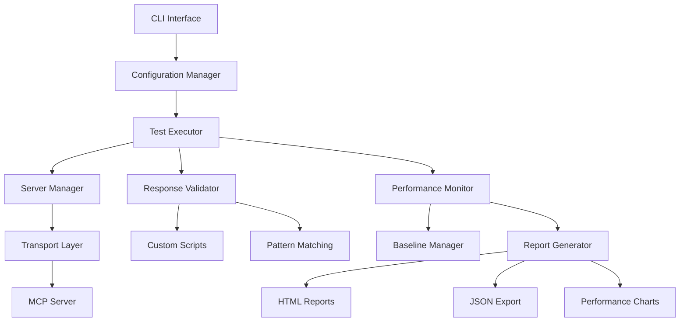

# Mandrel MCP Test Harness

A comprehensive testing framework for **Model Context Protocol (MCP) servers** with enterprise-grade capabilities.

The **Mandrel** project provides the **moth** binary (MOdel context protocol Test Harness) for command-line testing operations.

## 🌟 Key Features

### Protocol Compliance
- ✅ **MCP Protocol Validation** - Full MCP 2024-11-05 specification compliance
- ✅ **Transport Testing** - stdio, HTTP, WebSocket transport validation
- ✅ **Capability Detection** - Automatic server capability discovery
- ✅ **Error Handling** - Comprehensive error condition testing

### Performance & Scale
- ✅ **Concurrent Execution** - Configurable parallelism with resource limits
- ✅ **Performance Baselines** - Historical performance tracking
- ✅ **Regression Detection** - Automatic performance regression alerts
- ✅ **Stress Testing** - High-load testing capabilities

### Validation & Quality
- ✅ **Pattern Matching** - Flexible response validation patterns
- ✅ **Custom Scripts** - Python/JavaScript custom validation logic
- ✅ **Security Testing** - Built-in security compliance validation
- ✅ **Edge Case Testing** - Comprehensive error and edge case coverage

### Production Ready
- ✅ **CI/CD Integration** - GitHub Actions, GitLab CI, Jenkins support
- ✅ **Docker Support** - Full containerization with multi-stage builds
- ✅ **Monitoring Integration** - Prometheus, Grafana, CloudWatch support
- ✅ **Enterprise Features** - Role-based access, audit logging, compliance reporting

## 🚀 Quick Start

```bash
# Install from source
cargo install --path crates/mandrel-mcp-th

# Run your first test
moth test my-server.yaml

# Validate a specification
moth validate my-server.yaml
```

## 📚 Documentation Sections

### Getting Started
- **[Quick Start Guide](getting-started/quick-start)** - Get up and running in 5 minutes
- **[Installation Guide](getting-started/installation)** - Complete installation instructions

### Reference Documentation
- **[CLI Reference](cli-reference)** - Complete command-line documentation
- **[Configuration Reference](configuration-reference)** - Complete YAML specification format
- **[User Guide](user-guide)** - Comprehensive testing guide

### Operations & Production
- **[Performance Tuning](performance-tuning)** - Optimize test execution and server performance  
- **[Production Deployment](production-deployment)** - Enterprise deployment guide
- **[Troubleshooting](troubleshooting)** - Common issues and solutions

### Examples & Resources
- **[Examples](examples/codeprism-mcp.yaml)** - Real-world test specifications
- **[Test Results & Reports](user-guide#understanding-test-output)** - Understanding test output

## 🏗️ Architecture Overview

The MCP Test Harness consists of several key components:



### Core Components
- **Configuration Manager**: YAML/JSON configuration parsing and validation
- **Test Executor**: Asynchronous test execution with concurrency control
- **Server Manager**: MCP server lifecycle management (stdio, HTTP, WebSocket)
- **Response Validator**: Pattern matching and custom script validation
- **Performance Monitor**: Real-time monitoring with regression detection
- **Report Generator**: Multi-format reporting with visualizations

## 📊 Test Categories

### Core Testing
- **Initialization Testing** - Server startup and handshake validation
- **Capability Testing** - Feature detection and capability validation
- **Resource Testing** - File, memory, and network resource testing
- **Tool Testing** - Individual tool functionality validation

### Advanced Testing  
- **Integration Testing** - Multi-tool workflow validation
- **Performance Testing** - Latency, throughput, and resource usage
- **Security Testing** - Authorization, input validation, data protection
- **Compliance Testing** - Protocol compliance and standard conformance

### Specialized Testing
- **Error Condition Testing** - Failure scenarios and error recovery
- **Edge Case Testing** - Boundary conditions and unusual inputs
- **Stress Testing** - High load and resource exhaustion scenarios
- **Regression Testing** - Automated change impact detection

## 🎓 Learning Path

### Beginner (New to MCP Test Harness)
1. [Installation Guide](getting-started/installation) - Set up your environment
2. [Quick Start Tutorial](getting-started/quick-start) - Run your first test
3. [User Guide](user-guide) - Master the command-line interface

### Intermediate (Regular User)
1. [Configuration Reference](configuration-reference) - Advanced configuration patterns
2. [Performance Tuning](performance-tuning) - Optimize test execution
3. [Production Deployment](production-deployment) - Enterprise deployment

### Advanced (Power User/Developer)
1. [Troubleshooting Guide](troubleshooting) - Debug complex issues
2. [Production Deployment](production-deployment) - Enterprise deployment
3. [Performance Tuning](performance-tuning) - Optimize for scale

## 🆘 Getting Help

- 📖 **Documentation Issues**: If you find documentation unclear or missing
- 🐛 **Bug Reports**: For software bugs and unexpected behavior  
- 💡 **Feature Requests**: For new functionality suggestions
- ❓ **Usage Questions**: For help with configuration and usage

### Support Channels
- **GitHub Issues**: [Report issues and bugs](https://github.com/rustic-ai/codeprism/issues)
- **GitHub Discussions**: [Community Q&A](https://github.com/rustic-ai/codeprism/discussions)
- **Documentation**: Complete reference materials (this site)

---

**Ready to get started?** Begin with our [Quick Start Guide](getting-started/quick-start) to run your first test in under 5 minutes! 🚀 