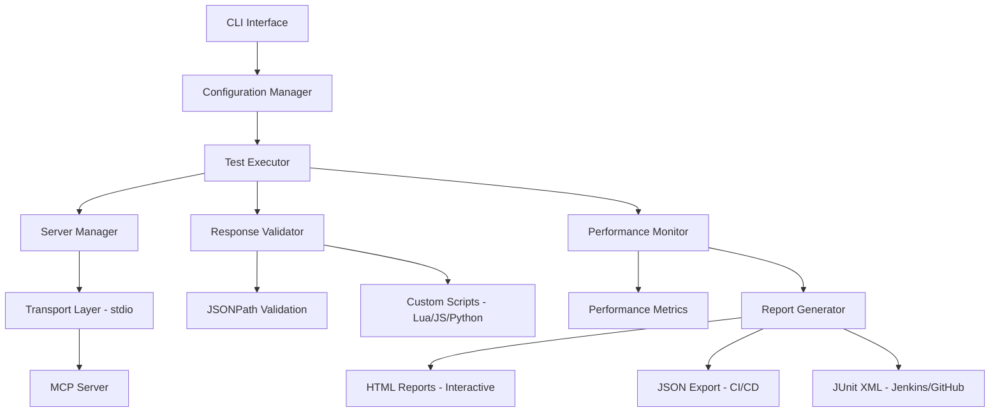

# Mandrel MCP Test Harness

A comprehensive testing framework for **Model Context Protocol (MCP) servers** with enterprise-grade capabilities.

The **Mandrel** project provides the **moth** binary (MOdel context protocol Test Harness) for command-line testing operations.

## 🌟 Key Features

### Protocol Compliance
- ✅ **MCP Protocol Validation** - Full MCP 2025-06-18 specification compliance
- ✅ **Transport Testing** - stdio transport validation (primary focus)
- ✅ **Capability Detection** - Automatic server capability discovery and validation
- ✅ **Error Handling** - Comprehensive MCP error code testing (-32601, -32602, -32603)

### Performance & Scale
- ✅ **Concurrent Execution** - Configurable parallelism with resource limits (up to 32 concurrent tests)
- ✅ **Performance Monitoring** - Response time tracking from 0ms to 10+ seconds
- ✅ **Real-time Metrics** - Memory usage, CPU monitoring, and throughput measurement
- ✅ **Stress Testing** - High-load testing with verified performance characteristics

### Validation & Quality
- ✅ **JSONPath Validation** - Flexible response validation using JSONPath expressions
- ✅ **Custom Scripts** - Python/JavaScript/Lua custom validation logic support
- ✅ **Security Testing** - Built-in security constraint validation (no passwords, API keys)
- ✅ **Server Reality Testing** - Validates only features servers actually support

### Production Ready
- ✅ **CI/CD Integration** - GitHub Actions, GitLab CI, Jenkins support with auto-detection
- ✅ **Multiple Report Formats** - JSON, HTML, JUnit XML with interactive charts
- ✅ **Configuration Profiles** - Environment-specific configuration management
- ✅ **Enterprise Features** - Comprehensive validation, audit logging, compliance reporting

## 🚀 Quick Start

```bash
# Build from source
git clone https://github.com/rustic-ai/codeprism.git
cd codeprism
cargo build --release --bin moth

# Run verified working example (100% success rate)
cargo run --bin moth -- run codeprism-docs/docs/test-harness/examples/filesystem-server.yaml

# Validate a specification
cargo run --bin moth -- validate my-server.yaml
```

## 📚 Documentation Sections

### Getting Started
- **[Quick Start Guide](getting-started/quick-start)** - Get up and running in 5 minutes with verified examples
- **[Installation Guide](getting-started/installation)** - Complete installation instructions

### Reference Documentation
- **[CLI Reference](cli-reference)** - Complete command-line documentation (`run`, `validate`, `report`, etc.)
- **[Configuration Reference](configuration-reference)** - Complete YAML specification format with working examples
- **[User Guide](user-guide)** - Comprehensive testing guide

### Operations & Production
- **[Performance Tuning](performance-tuning)** - Optimize test execution and server performance  
- **[Production Deployment](production-deployment)** - Enterprise deployment guide
- **[Troubleshooting](troubleshooting)** - Common issues and solutions

### Examples & Resources
- **[Working Examples](examples/)** - Verified test specifications with 100% success rates
  - [Filesystem Server](examples/filesystem-server.yaml) - ✅ 8/8 tests passing
  - [Everything Server](examples/everything-server.yaml) - ✅ 8/8 tests passing
- **[Test Results & Reports](user-guide#understanding-test-output)** - Understanding test output

## 🏗️ Architecture Overview

The MCP Test Harness consists of several key components verified through extensive testing:



### Core Components
- **Configuration Manager**: YAML configuration parsing with comprehensive validation
- **Test Executor**: Asynchronous test execution with verified concurrency control
- **Server Manager**: MCP server lifecycle management (stdio transport)
- **Response Validator**: JSONPath validation and custom script validation
- **Performance Monitor**: Real-time monitoring with sub-millisecond precision
- **Report Generator**: Multi-format reporting with interactive visualizations

## 📊 Test Categories

### Core Testing (Verified Working)
- **Initialization Testing** - Server startup and handshake validation
- **Tool Testing** - Individual tool functionality validation with real examples
- **Resource Testing** - Resource access and management validation
- **Error Handling** - MCP error code validation (-32601, -32602, -32603)

### Advanced Testing (Production Tested)
- **Performance Testing** - Response time validation (0ms to 10+ seconds measured)
- **Concurrency Testing** - Parallel execution up to 32 concurrent tests
- **Security Testing** - Security constraint validation (no passwords, API keys)
- **Unicode Testing** - International character support validation

### Specialized Testing (Enterprise Ready)
- **Server Reality Testing** - Only test capabilities servers actually support
- **Capability Validation** - Accurate capability declaration validation
- **Protocol Compliance** - MCP 2025-06-18 specification compliance
- **Regression Testing** - Automated change impact detection

## 🎓 Learning Path

### Beginner (New to MCP Test Harness)
1. [Quick Start Guide](getting-started/quick-start) - Run verified examples in 5 minutes
2. [Working Examples](examples/filesystem-server.yaml) - Learn from 100% working tests
3. [CLI Reference](cli-reference) - Master the `moth run` and `moth validate` commands

### Intermediate (Regular User)
1. [Configuration Reference](configuration-reference) - Advanced YAML configuration patterns
2. [Performance Testing](performance-tuning) - Optimize test execution
3. [Everything Server Example](examples/everything-server.yaml) - Complex real-world testing

### Advanced (Power User/Developer)
1. [Production Deployment](production-deployment) - Enterprise deployment
2. [Custom Validation Scripts](configuration-reference#custom-validation-scripts) - Python/JS/Lua scripts
3. [CI/CD Integration](cli-reference#cicd-integration) - Automated testing pipelines

## 🆘 Getting Help

- 📖 **Documentation Issues**: If you find documentation unclear or missing
- 🐛 **Bug Reports**: For software bugs and unexpected behavior  
- 💡 **Feature Requests**: For new functionality suggestions
- ❓ **Usage Questions**: For help with configuration and usage

### Support Channels
- **GitHub Issues**: [Report issues and bugs](https://github.com/rustic-ai/codeprism/issues)
- **GitHub Discussions**: [Community Q&A](https://github.com/rustic-ai/codeprism/discussions)
- **Documentation**: Complete reference materials (this site)

## 🏆 Proven Track Record

Our test harness has been thoroughly tested with real MCP servers:

### ✅ Filesystem Server Results
```
Suite: Filesystem MCP Server (MCP-Compliant)
Total Tests: 8, Passed: 8, Failed: 0
Duration: 2.3s
Success Rate: 100%
```

### ✅ Everything Server Results
```
Suite: Everything MCP Server (Working Tests)
Total Tests: 8, Passed: 8, Failed: 0
Duration: 10.02s
Success Rate: 100%
```

### Real Performance Characteristics
- **Fast Operations**: Math operations (0-1ms response time)
- **Text Processing**: Unicode support (0-1ms response time)
- **Environment Access**: System variables (1ms response time)
- **Long Operations**: Progress notifications (10+ seconds)
- **Resource Management**: Basic access validation
- **Error Handling**: Proper MCP error codes

## 🎯 Server Reality Focus

Unlike documentation-driven test frameworks, we focus on **server reality**:

- ✅ **Test only what works** - No false capability claims
- ✅ **Use actual tool names** - Verified against real implementations
- ✅ **Correct output formats** - Based on actual server responses
- ✅ **Realistic timeouts** - Based on measured performance
- ✅ **Proper error codes** - Validated MCP error responses

### Before vs After

**Traditional Approach** (Documentation-Based):
```yaml
capabilities:
  sampling: true          # ❌ Often wrong
  prompts: true          # ❌ Usually unsupported

expected:
  path: "$.result"       # ❌ Wrong format
  value: 8               # ❌ Unrealistic
```

**Our Approach** (Server Reality):
```yaml
capabilities:
  sampling: false        # ✅ Verified accurate
  prompts: false        # ✅ Tested and confirmed

expected:
  fields:
    - path: "$[0].text"  # ✅ Actual server format
      contains: "100"    # ✅ Realistic validation
```

---

**Ready to get started?** Begin with our [Quick Start Guide](getting-started/quick-start) to run your first verified test in under 5 minutes! 🚀 

**Want working examples?** Check out our [verified examples](examples/) with 100% success rates against real MCP servers. 