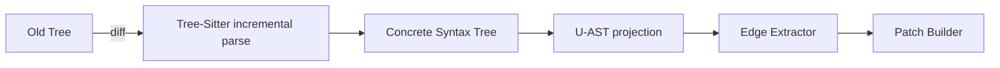

## Deep-dive: G-Core (Incremental Polyglot Parser) + Graph Store

> Implementation language: **Rust 2021** (safe, zero-cost FFI to Tree-Sitter, excellent async + Neo4j drivers).
> Runtime target: Linux x86-64, **minimum Rust 1.78**.

---

### 1. G-Core — responsibilities & top-level crate layout

```
pags/
 ├─ crates/
 │   ├─ core/          # lib: incremental parser + edge extractor
 │   ├─ lang_js/       # per-language adapters (feature-gated)
 │   ├─ bus/           # Kafka producer for AstPatch
 │   └─ bin/
 │       ├─ pagsd      # daemon: watch FS, parse, publish patches
 │       └─ pags-cli   # one-shot parser / debug
 └─ Cargo.toml
```

`core` is completely language-agnostic; each `lang_*` crate turns a Tree-Sitter CST into the *Universal-AST* (U-AST) structs exported by `core`.

---

### 2. File-change detection

| Source       | Library / syscall                  | Notes                                          |
| ------------ | ---------------------------------- | ---------------------------------------------- |
| Editor saves | `notify` crate (inotify / fsevent) | Low latency; debounce 50 ms.                   |
| Git commits  | `pre-commit`, `post-commit` hooks  | Emit synthetic “diff” events for CI pipelines. |

Each event yields `(repo_root, path, ChangeKind)` where `ChangeKind` is `Created | Modified | Deleted | Renamed(old, new)`.

---

### 3. Incremental parse pipeline



#### 3.1 Tree-Sitter integration

```rust
let mut parser = Parser::new();
parser.set_language(tree_sitter_javascript::language())?;
let tree = parser.parse(&src, old_tree.as_ref());
```

* Keep a `HashMap<PathBuf, (Tree, mtime)>`.
* Reuse the old tree for incremental speed (< 5 µs/LOC).

#### 3.2 Universal-AST (U-AST)

```rust
#[derive(Clone, Debug, Serialize)]
pub enum NodeKind {
    Module, Class, Function, Method, Parameter,
    Variable, Call, Import, Literal, Route,
    SqlQuery, Event, Unknown,
}

#[derive(Clone, Debug, Serialize)]
pub struct Node {
    pub id: NodeId,           // stable
    pub kind: NodeKind,
    pub name: String,
    pub lang: Lang,
    pub file: Arc<PathBuf>,
    pub span: Span,           // byte + line ranges
    pub sig: Option<String>,  // param → return type
}
```

* `NodeId` = `blake3(repo_id | file_path | span | kind)`, 16 bytes.
* `Lang` is an enum (`Js`, `Py`, `Java`, …); determined by file suffix.

#### 3.3 Edge extraction

Visitor pattern over the U-AST:

```
src_node ──CALLS────▶ dst_node
           READS
           WRITES
           IMPORTS
           EMITS        (Kafka, SNS, etc.)
           ROUTES_TO    (HTTP path → controller)
           RAISES
```

Edges are emitted as `(src_id, EdgeKind, dst_id)`.

Per-language extractor crates expose one public fn:

```rust
pub fn analyse(tree: &Tree, source: &str, file: &Path)
    -> (Vec<Node>, Vec<Edge>);
```

---

### 4. Patch generation (`AstPatch`)

```protobuf
message AstPatch {
  string repo;
  string commit_sha;
  repeated NodeAdd nodes_add      = 1;
  repeated EdgeAdd edges_add      = 2;
  repeated string nodes_delete_id = 3;
  repeated string edges_delete_id = 4;
  int64 timestamp_unix_ms         = 5;
}
```

* `NodeAdd` and `EdgeAdd` mirror the Rust structs 1-to-1 (`prost` derives).
* G-Core diffs old/new *id* sets to populate `delete` arrays.
* One patch = **one Kafka message** (`lz4` compressed).

---

### 5. Graph Store (Neo4j 5.x, Bolt v5)

#### 5.1 Data model

| Element | Label / Type          | Properties                                                                       | Indices                                          |
| ------- | --------------------- | -------------------------------------------------------------------------------- | ------------------------------------------------ |
| Node    | `:CodeSymbol`         | `id` (PK, string, UNIQUE), `name`, `kind`, `lang`, `file`, `start`, `end`, `sig` | `INDEX ON :CodeSymbol(id)` + full-text on `name` |
| Edge    | `:CALLS`, `:READS`, … | none (only start / end)                                                          | —                                                |

* All edges inherit `id` of form `"{src_id}>{dst_id}:{kind}"`; optional for constraints.
* Enable **Graph Data Science “K-shortest path”** plugin for multi-target tracers.

#### 5.2 Upsert strategy

```cypher
UNWIND $nodes_add AS n
MERGE (s:CodeSymbol {id: n.id})
  ON CREATE SET s += n.props
  ON MATCH  SET s += n.props;

UNWIND $edges_add AS e
MATCH (a:CodeSymbol {id: e.src}), (b:CodeSymbol {id: e.dst})
MERGE (a)-[r:` + e.kind + `]->(b);
```

* Execute inside a **single WRITE TRANSACTION** per patch (Neo4j driver async session).
* Batch size tuning: 2 000 nodes + 5 000 edges → < 80 ms on 8-core box.

#### 5.3 Deletions

```cypher
UNWIND $nodes_del AS nid
MATCH (n:CodeSymbol {id: nid}) DETACH DELETE n;

UNWIND $edges_del AS eid
MATCH ()-[r]->() WHERE r.id = eid DELETE r;
```

#### 5.4 Versioning (optional)

Add `valid_from`, `valid_to` timestamp props (default `2^63-1`). Deletion becomes `SET r.valid_to = ts`.

---

### 6. Concurrency model

* **Single writer**: only G-Core writes.
* **Readers** (MCP server, analytics) use separate driver pool, `READ` transactions.
* For high-volume monorepos: upgrade to **Neo4j causal-cluster** (RAFT, 1 writer, N followers).

---

### 7. Performance and memory

* One **CodeSymbol** ≈ 150 bytes; 10 M nodes ≈ 1.5 GB store file (+ indices).
* Keep an **LRU cache** of recent `Tree` objects (path → tree) in G-Core; size 256 MB.

---

### 8. Extending with new languages

1. Add `tree-sitter-<lang>` crate; feature-gate in `Cargo.toml`.
2. Implement `analyse()` producing U-AST nodes/edges.
3. Register in `LanguageRegistry`:

```rust
registry.register("go", Lang::Go, analyse_go);
```

4. Unit-test against `tests/fixtures/go/*.go`.

---

### 9. Automated testing matrix

| Layer           | Test kind                                    | Tooling                               |
| --------------- | -------------------------------------------- | ------------------------------------- |
| Parser          | Golden output diff (`insta` crate snapshots) | `cargo insta`                         |
| Edge extraction | Property-based (`proptest`)                  | Verify no orphan edges.               |
| Patch builder   | Round-trip apply-reparse                     | Spin up temp Neo4j in Docker.         |
| Perf            | Criterion benchmarks                         | `cargo bench` changed-file latency.   |
| Integration     | `docker-compose` (Neo4j + Kafka + pagsd)     | End-to-end: edit file → node appears. |

---

### 10. Implementation checklist

1. **Create workspace & add crates** (see earlier cargo commands).
2. **Implement U-AST structs + serde/prost derivations**.
3. **Write generic `ParserEngine`**: manage registry of `(Lang, Parser)`.
4. **Implement per-language adaptor crates**: JS/TS, Python, Java.
5. **Write `EdgeExtractor` trait + default visitors**.
6. **Diff store of `NodeId`/`EdgeId` → produce `AstPatch`**.
7. **Kafka producer** with `rust-rdkafka` (acks=all, linger.ms=10).
8. **Neo4j store module**: async Bolt driver, batched Cypher upserts.
9. **`pagsd` daemon**:

   * FS watcher → `ParserEngine::update()` → `AstPatch`.
   * Send patch to Kafka, call `Store::apply(patch)` synchronously.
10. **Integration tests** using `testcontainers-rs`: mount sample repo; modify a line; assert graph change.

---

### 11. Ready-for-use artefacts

* **`libpags_core.so`** – language-agnostic dynamic library; can be embedded in other tools.
* **`pagsd`** – background daemon.
* **`pags-cli`** – developer utility: `pags trace src/Login.tsx:55 --to SqlQuery`.

---

### 12. Key implementation watch-outs

* **Incremental parsing correctness**: Tree-Sitter requires byte offsets; keep UTF-8 → byte maps.
* **Stable IDs**: must not reuse after move/rename → include file path **after** normalisation.
* **Large file handling**: skip > 1 MB files unless extension whitelisted.
* **Cross-lang linkers**: run *after* all languages parsed so every potential target exists.
* **Back-pressure**: if Neo4j commit time > input rate, buffer patches on Kafka topic partition and monitor lag.

---

With these details you have **everything required to code, integrate and validate** the parsing engine and the graph database layer. The remaining MCP server is a thin, read-only veneer atop this robust core.
