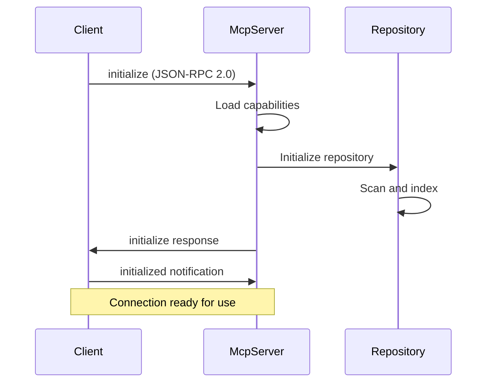
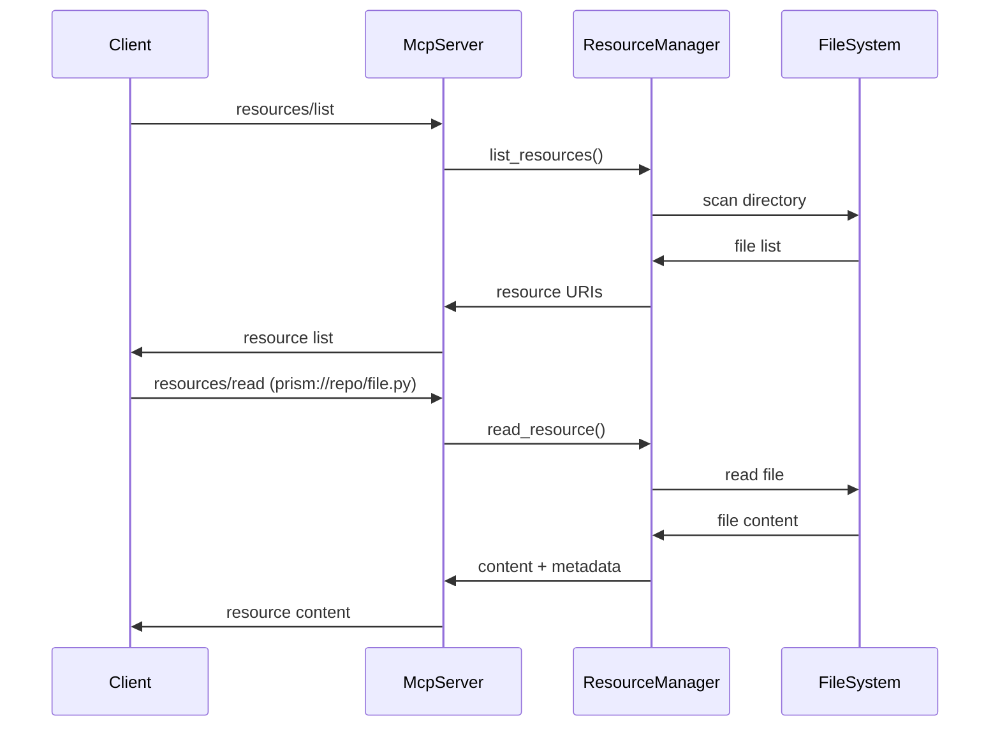
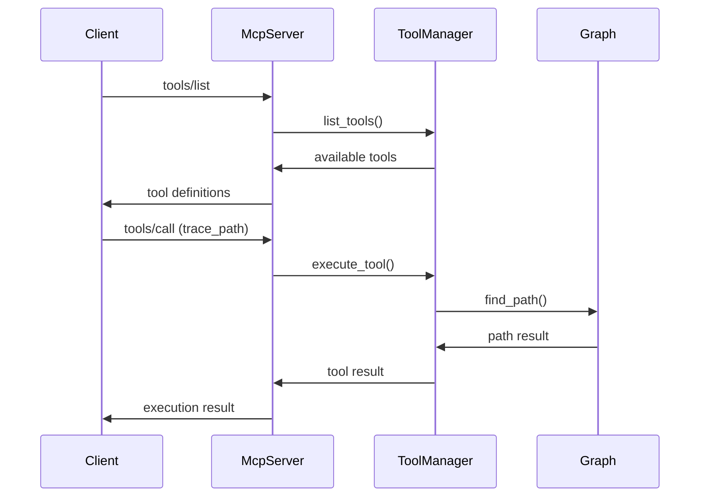

# Architecture Guide

This document describes the high-level architecture, design decisions, and implementation details of Prism.

**🚨 ARCHITECTURAL PIVOT - December 2024**

After detailed review against official MCP (Model Context Protocol) documentation, the architecture has been **significantly simplified** to ensure MCP compliance and optimal client integration.

## Table of Contents

- [System Overview](#system-overview)
- [Core Principles](#core-principles)
- [MCP-Compliant Architecture](#mcp-compliant-architecture)
- [Data Flow](#data-flow)
- [Storage Design](#storage-design)
- [Performance Architecture](#performance-architecture)
- [Security Architecture](#security-architecture)
- [Deployment Architecture](#deployment-architecture)

## System Overview

Prism is a **MCP-compliant** graph-first code intelligence system designed to provide real-time, accurate code understanding for LLM assistants. The system implements the Model Context Protocol (JSON-RPC 2.0) specification to integrate seamlessly with MCP clients like Claude Desktop, Cursor, and VS Code GitHub Copilot.

### **MCP-Optimized Architecture**

```
┌─────────────────────────────────────────────────────────────┐
│                   MCP-Compliant Prism                      │
├─────────────────────────────────────────────────────────────┤
│  MCP Clients                                                │
│  ┌─────────────┐ ┌─────────────┐ ┌─────────────┐           │
│  │   Claude    │ │   Cursor    │ │  VS Code    │           │
│  │  Desktop    │ │   Editor    │ │  Copilot    │           │
│  └─────────────┘ └─────────────┘ └─────────────┘           │
│         │               │               │                 │
│         └───────────────┼───────────────┘                 │
│                         ▼ (JSON-RPC 2.0)                 │
│  ┌─────────────────────────────────────────────────────────┐ │
│  │              Prism MCP Server                           │ │
│  │  ┌─────────────┐ ┌─────────────┐ ┌─────────────┐       │ │
│  │  │ Resources   │ │   Tools     │ │  Prompts    │       │ │
│  │  │ Manager     │ │ Manager     │ │ Manager     │       │ │
│  │  └─────────────┘ └─────────────┘ └─────────────┘       │ │
│  │                                                         │ │
│  │  ┌─────────────────────────────────────────────────────┐ │ │
│  │  │              JSON-RPC 2.0 Transport                │ │ │
│  │  │  ┌─────────────┐ ┌─────────────┐                   │ │ │
│  │  │  │   stdio     │ │ HTTP + SSE  │                   │ │ │
│  │  │  │ (Primary)   │ │ (Optional)  │                   │ │ │
│  │  │  └─────────────┘ └─────────────┘                   │ │ │
│  │  └─────────────────────────────────────────────────────┘ │ │
│  └─────────────────────────────────────────────────────────┘ │
│                         │                                   │
│                         ▼                                   │
│  ┌─────────────────────────────────────────────────────────┐ │
│  │          Repository Manager                             │ │
│  │  ┌─────────────┐ ┌─────────────┐ ┌─────────────┐       │ │
│  │  │ Repository  │ │   Parser    │ │ File        │       │ │
│  │  │  Scanner    │ │   Engine    │ │ Watcher     │       │ │
│  │  └─────────────┘ └─────────────┘ └─────────────┘       │ │
│  │                                                         │ │
│  │  ┌─────────────┐ ┌─────────────┐ ┌─────────────┐       │ │
│  │  │ Bulk        │ │   Pipeline  │ │ Language    │       │ │
│  │  │ Indexer     │ │ Integration │ │ Parsers     │       │ │
│  │  └─────────────┘ └─────────────┘ └─────────────┘       │ │
│  └─────────────────────────────────────────────────────────┘ │
│                         │                                   │
│                         ▼                                   │
│  ┌─────────────────────────────────────────────────────────┐ │
│  │      In-Memory Graph + Optional Persistence             │ │
│  │  ┌─────────────┐ ┌─────────────┐ ┌─────────────┐       │ │
│  │  │  DashMap    │ │  LRU Cache  │ │ Optional    │       │ │
│  │  │ (Live Graph)│ │ (Parsed AST)│ │ File Cache  │       │ │
│  │  └─────────────┘ └─────────────┘ └─────────────┘       │ │
│  └─────────────────────────────────────────────────────────┘ │
└─────────────────────────────────────────────────────────────┘
```

**Key Architectural Changes**:
- ❌ **Removed**: Neo4j, Kafka, Redis (over-engineered for MCP)
- ✅ **Added**: JSON-RPC 2.0 transport layer (MCP requirement)
- ✅ **Simplified**: In-memory graph storage with optional persistence
- ✅ **Optimized**: stdio transport for fast MCP client integration

## Core Principles

### 1. **MCP Protocol Compliance**

Prism strictly adheres to the Model Context Protocol specification:

- **JSON-RPC 2.0**: All communication uses proper JSON-RPC 2.0 format
- **Initialization Handshake**: Proper capability negotiation
- **Resource/Tool/Prompt Standards**: Exact specification compliance
- **Transport Layer**: stdio (primary) and HTTP+SSE (optional)

### 2. **Simplicity Over Complexity**

Based on MCP best practices:
- **Local Execution**: Fast, local processing without network dependencies
- **Simple Storage**: In-memory graph with optional file persistence
- **Direct Access**: No middleware layers or complex routing
- **Fast Response**: < 100ms for most operations

### 3. **Graph-First Design**

Maintains the core strength of Prism:
- **Structural Understanding**: Relationships between functions, classes, and modules
- **Cross-Language Analysis**: Unified representation across programming languages
- **Efficient Queries**: Graph traversal for code navigation and analysis

### 4. **Real-Time Updates**

Optimized for MCP client expectations:
- **File Watching**: Sub-second detection of changes
- **Incremental Updates**: Only changed components are updated
- **Event Notifications**: Optional real-time updates via SSE

## MCP-Compliant Architecture

### **JSON-RPC 2.0 Transport Layer**

```rust
// MCP Message Format
#[derive(Serialize, Deserialize)]
pub struct McpRequest {
    pub jsonrpc: String,                    // Always "2.0"
    pub id: serde_json::Value,              // Request ID (number | string)
    pub method: String,                     // MCP method name
    pub params: Option<serde_json::Value>,  // Method parameters
}

#[derive(Serialize, Deserialize)]
pub struct McpResponse {
    pub jsonrpc: String,                    // Always "2.0"
    pub id: serde_json::Value,              // Matching request ID
    pub result: Option<serde_json::Value>,  // Success result
    pub error: Option<McpError>,            // Error details
}

// Transport Options
pub enum Transport {
    Stdio,                                  // Primary: stdin/stdout
    Http {                                  // Optional: HTTP + SSE
        port: u16,
        sse_endpoint: Option<String>,
    },
}
```

### **MCP Server Components**

```rust
pub struct McpServer {
    // MCP Core Components
    capabilities: ServerCapabilities,
    resources: ResourceManager,
    tools: ToolManager,
    prompts: PromptManager,
    
    // Repository Components
    repository: RepositoryManager,
    transport: Transport,
    
    // State Management
    graph: Arc<DashMap<NodeId, Node>>,
    edges: Arc<DashMap<NodeId, Vec<Edge>>>,
}

// MCP Capability Declaration
pub struct ServerCapabilities {
    pub resources: ResourceCapabilities,
    pub tools: ToolCapabilities,
    pub prompts: PromptCapabilities,
    pub sampling: Option<SamplingCapabilities>,
}
```

### **Resource Manager (MCP Resources)**

```rust
pub struct ResourceManager {
    repository_path: PathBuf,
    supported_extensions: HashSet<String>,
}

impl ResourceManager {
    // MCP: resources/list
    pub async fn list_resources(&self) -> McpResult<ResourceList> {
        // Return available resources with URIs like:
        // - prism://repo/src/main.py (file content)
        // - prism://graph/nodes (graph nodes)
        // - prism://symbols/functions (code symbols)
    }
    
    // MCP: resources/read
    pub async fn read_resource(&self, uri: &str) -> McpResult<ResourceContent> {
        // Handle URIs and return appropriate content
        match uri {
            uri if uri.starts_with("prism://repo/") => self.read_file(uri).await,
            uri if uri.starts_with("prism://graph/") => self.read_graph_data(uri).await,
            uri if uri.starts_with("prism://symbols/") => self.read_symbols(uri).await,
            _ => Err(McpError::InvalidResource(uri.to_string())),
        }
    }
}
```

### **Tool Manager (MCP Tools)**

```rust
pub struct ToolManager {
    tools: HashMap<String, Box<dyn McpTool>>,
    graph: Arc<DashMap<NodeId, Node>>,
    edges: Arc<DashMap<NodeId, Vec<Edge>>>,
}

#[async_trait]
pub trait McpTool: Send + Sync {
    fn name(&self) -> &str;
    fn description(&self) -> &str;
    fn input_schema(&self) -> serde_json::Value;  // JSON Schema
    async fn call(&self, params: serde_json::Value) -> McpResult<ToolResult>;
}

// Example Tool Implementation
pub struct TracePathTool {
    graph: Arc<DashMap<NodeId, Node>>,
    edges: Arc<DashMap<NodeId, Vec<Edge>>>,
}

impl McpTool for TracePathTool {
    fn name(&self) -> &str { "trace_path" }
    
    fn description(&self) -> &str {
        "Trace execution paths between code symbols"
    }
    
    fn input_schema(&self) -> serde_json::Value {
        json!({
            "type": "object",
            "properties": {
                "source": {"type": "string", "description": "Source symbol ID"},
                "target": {"type": "string", "description": "Target symbol ID"},
                "max_depth": {"type": "number", "default": 10}
            },
            "required": ["source", "target"]
        })
    }
}
```

### **Prompt Manager (MCP Prompts)**

```rust
pub struct PromptManager {
    prompts: HashMap<String, Box<dyn McpPrompt>>,
    repository: Arc<RepositoryManager>,
}

#[async_trait]
pub trait McpPrompt: Send + Sync {
    fn name(&self) -> &str;
    fn description(&self) -> &str;
    fn arguments(&self) -> Vec<PromptArgument>;
    async fn generate(&self, args: HashMap<String, String>) -> McpResult<PromptResult>;
}

// Example: Repository Overview Prompt
pub struct RepoOverviewPrompt {
    repository: Arc<RepositoryManager>,
}

impl McpPrompt for RepoOverviewPrompt {
    fn name(&self) -> &str { "repo_overview" }
    
    async fn generate(&self, args: HashMap<String, String>) -> McpResult<PromptResult> {
        let stats = self.repository.get_statistics().await?;
        let overview = format!(
            "Repository Analysis:\n\
            Total files: {}\n\
            Languages: {:?}\n\
            Code symbols: {} functions, {} classes\n\
            ...",
            stats.total_files,
            stats.languages,
            stats.functions,
            stats.classes
        );
        
        Ok(PromptResult {
            description: "Comprehensive repository analysis".to_string(),
            messages: vec![PromptMessage {
                role: "user".to_string(),
                content: TextContent { text: overview },
            }],
        })
    }
}
```

## Data Flow

### 1. **MCP Client Connection**



### 2. **Resource Access**



### 3. **Tool Execution**



## Storage Design

### **Simplified In-Memory Storage**

```rust
// Primary Graph Storage (In-Memory)
pub struct GraphStore {
    nodes: Arc<DashMap<NodeId, Node>>,
    edges: Arc<DashMap<NodeId, Vec<Edge>>>,
    file_index: Arc<DashMap<PathBuf, Vec<NodeId>>>,
    symbol_index: Arc<DashMap<String, Vec<NodeId>>>,
}

// Optional Persistence Layer
pub struct PersistenceLayer {
    cache_dir: PathBuf,
    enable_cache: bool,
}

impl PersistenceLayer {
    pub async fn save_graph(&self, graph: &GraphStore) -> Result<()> {
        // Optional: Save graph to disk for faster startup
        if self.enable_cache {
            let data = bincode::serialize(&graph)?;
            tokio::fs::write(self.cache_dir.join("graph.bin"), data).await?;
        }
        Ok(())
    }
    
    pub async fn load_graph(&self) -> Result<Option<GraphStore>> {
        // Optional: Load cached graph from disk
        if self.enable_cache && self.cache_dir.join("graph.bin").exists() {
            let data = tokio::fs::read(self.cache_dir.join("graph.bin")).await?;
            let graph = bincode::deserialize(&data)?;
            Ok(Some(graph))
        } else {
            Ok(None)
        }
    }
}
```

### **Performance Optimizations**

```rust
// LRU Cache for Parsed ASTs
pub struct ParseCache {
    cache: Arc<Mutex<lru::LruCache<PathBuf, ParseResult>>>,
    max_size: usize,
}

// Memory Management
pub struct MemoryManager {
    max_nodes: usize,
    max_memory: usize,
    cleanup_threshold: f64,
}

impl MemoryManager {
    pub fn should_cleanup(&self, current_nodes: usize, current_memory: usize) -> bool {
        current_nodes > (self.max_nodes as f64 * self.cleanup_threshold) as usize ||
        current_memory > (self.max_memory as f64 * self.cleanup_threshold) as usize
    }
    
    pub fn cleanup_strategy(&self) -> CleanupStrategy {
        // Remove least recently used nodes/edges
        CleanupStrategy::LeastRecentlyUsed
    }
}
```

## Performance Architecture

### **MCP-Optimized Performance Targets**

**Target Metrics (MCP Requirement)**:
- **Initialization**: < 2s for typical repository (1000 files)
- **Resource Access**: < 100ms per file read
- **Tool Execution**: < 500ms for complex queries
- **Memory Usage**: < 1GB for 10k nodes
- **Update Latency**: < 250ms for file changes

**Performance Strategies**:

1. **Lazy Loading**: Only parse files when accessed
2. **Incremental Processing**: Only update changed files
3. **Memory Limits**: Automatic cleanup when limits reached
4. **Async Operations**: Non-blocking I/O for all operations

### **Caching Strategy (Simplified)**

```
┌─────────────────────────────────────────────────────────────┐
│                 MCP-Optimized Caching                      │
├─────────────────────────────────────────────────────────────┤
│  L1: In-Process Memory (Primary)                           │
│  ├─ Live Graph: DashMap (thread-safe)                      │
│  ├─ Parse Cache: LRU (recent files)                        │
│  └─ Query Cache: HashMap (common queries)                  │
├─────────────────────────────────────────────────────────────┤
│  L2: Optional File Cache (Secondary)                       │
│  ├─ Serialized Graph: bincode format                       │
│  ├─ Parse Results: msgpack format                          │
│  └─ Statistics: JSON format                                │
└─────────────────────────────────────────────────────────────┘
```

## Security Architecture

### **MCP Security Model**

Based on MCP security requirements:

```rust
pub struct SecurityManager {
    allowed_paths: Vec<PathBuf>,
    file_access_limits: FileAccessLimits,
    resource_permissions: ResourcePermissions,
}

#[derive(Debug)]
pub struct FileAccessLimits {
    max_file_size: usize,           // 10MB default
    max_files_per_request: usize,   // 100 default
    allowed_extensions: HashSet<String>,
    blocked_paths: Vec<PathBuf>,    // .git, node_modules, etc.
}

impl SecurityManager {
    pub fn validate_file_access(&self, path: &Path) -> SecurityResult<()> {
        // Check if path is within allowed repository
        if !self.is_path_allowed(path) {
            return Err(SecurityError::PathNotAllowed(path.to_path_buf()));
        }
        
        // Check file size limits
        if let Ok(metadata) = path.metadata() {
            if metadata.len() > self.file_access_limits.max_file_size as u64 {
                return Err(SecurityError::FileTooLarge);
            }
        }
        
        // Check extension whitelist
        if let Some(ext) = path.extension() {
            if !self.file_access_limits.allowed_extensions.contains(ext.to_str().unwrap_or("")) {
                return Err(SecurityError::ExtensionNotAllowed);
            }
        }
        
        Ok(())
    }
}
```

### **Privacy Controls (MCP Requirements)**

1. **Repository Boundaries**: Strict containment within specified paths
2. **File System Permissions**: Respects OS access controls
3. **No External Network**: Pure local analysis
4. **User Consent**: Clear indication of access scope
5. **Data Minimization**: Only process requested files

## Deployment Architecture

### **MCP Client Integration**

```yaml
# Claude Desktop Configuration
# ~/.config/claude-desktop/claude-desktop.json
{
  "mcpServers": {
    "gcore": {
      "command": "gcore",
      "args": ["serve", "/path/to/repository"],
      "env": {
        "PRISM_LOG_LEVEL": "info",
        "PRISM_CACHE_ENABLED": "true"
      }
    }
  }
}

# Cursor Configuration
# .vscode/settings.json
{
  "mcp.servers": [
    {
      "name": "gcore",
      "command": ["gcore", "serve", "."],
      "capabilities": ["resources", "tools", "prompts"]
    }
  ]
}
```

### **Development Environment**

```yaml
# docker-compose.yml (Optional - for development)
version: '3.8'
services:
  gcore-dev:
    build: .
    environment:
      RUST_LOG: debug
      PRISM_REPOSITORY_PATH: /workspace
    volumes:
      - ./:/workspace
    command: ["gcore", "serve", "/workspace", "--http", "--port", "8080"]
    ports:
      - "8080:8080"
```

### **Production Deployment (Simplified)**

```bash
# Single Binary Deployment
curl -L https://github.com/org/gcore/releases/latest/download/gcore-linux-x64 -o gcore
chmod +x gcore

# Configure MCP Client
gcore configure --client claude-desktop --repository /path/to/repo

# Start as daemon (optional)
gcore daemon /path/to/repo --log-level info
```

### **Monitoring (Simplified)**

```rust
// Built-in Metrics
pub struct Metrics {
    pub requests_total: Counter,
    pub request_duration: Histogram,
    pub active_connections: Gauge,
    pub memory_usage: Gauge,
}

// Health Check Endpoint (HTTP mode only)
#[derive(Serialize)]
pub struct HealthStatus {
    pub status: String,
    pub uptime: Duration,
    pub repository_path: PathBuf,
    pub nodes_count: usize,
    pub memory_usage: usize,
}
```

## Conclusion

This **MCP-compliant architecture** provides a robust, performant, and standards-compliant foundation for Prism that:

1. **Meets MCP Requirements**: Full JSON-RPC 2.0 compliance with proper transport
2. **Optimizes for Simplicity**: Removed unnecessary complexity for better performance
3. **Enables Client Integration**: Direct compatibility with all major MCP clients
4. **Maintains Core Strengths**: Graph-first intelligence with real-time updates
5. **Ensures Security**: Proper boundaries and permission controls

The simplified architecture delivers the same graph-based code intelligence capabilities while ensuring seamless integration with the rapidly growing MCP ecosystem. 