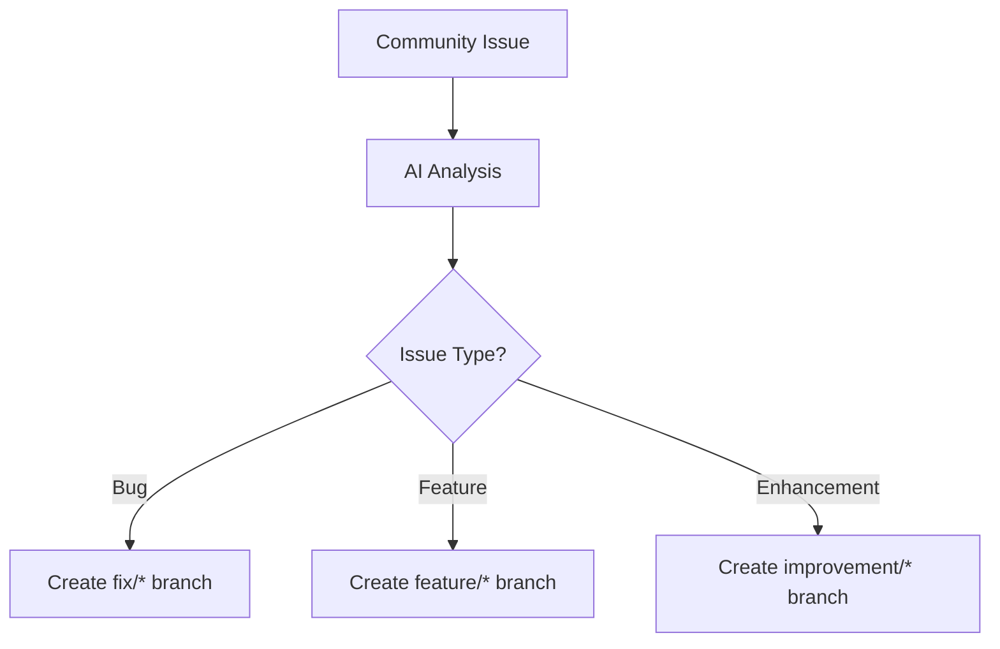

# Git Branch Strategy for CodeCodePrism 🌿

> **A unique branching strategy for the world's first 100% AI-generated open source project**

## 🤖 AI-Driven Development Model

Traditional Git workflows are designed for human teams with code reviews, collaboration, and manual merging. CodeCodePrism uses a **revolutionary AI-driven branching strategy** optimized for our AI developer's autonomous development process.

## 🏗️ Branch Structure

### 🌟 Primary Branches

#### `main` - Production Branch
- **Purpose**: Stable, production-ready code
- **Protection**: Branch protection enabled
- **Auto-deployment**: Triggers releases and deployments
- **Merge policy**: Only from `develop` via automated workflows
- **AI Access**: Read-only (writes via automation only)

#### `develop` - Integration Branch  
- **Purpose**: Integration branch for AI development
- **Protection**: Basic protections enabled
- **Testing**: All CI/CD tests must pass
- **Merge policy**: Fast-forward merges from feature branches
- **AI Access**: Direct write access for AI developer

### 🚀 Supporting Branches

#### `feature/*` - Feature Development
- **Naming**: `feature/ai-implements-<feature-name>`
- **Purpose**: Individual features developed by AI
- **Lifecycle**: Created and merged by AI autonomously
- **Examples**:
  - `feature/ai-implements-rust-parser`
  - `feature/ai-implements-security-analysis`
  - `feature/ai-implements-performance-optimization`

#### `fix/*` - Bug Fixes
- **Naming**: `fix/ai-resolves-<issue-number>-<description>`
- **Purpose**: Bug fixes based on community reports
- **Lifecycle**: AI creates branch, implements fix, auto-merges
- **Examples**:
  - `fix/ai-resolves-123-memory-leak`
  - `fix/ai-resolves-456-parsing-error`

#### `improvement/*` - Code Improvements
- **Naming**: `improvement/ai-enhances-<component>`
- **Purpose**: Performance, maintainability, or quality improvements
- **Lifecycle**: AI-driven autonomous improvements
- **Examples**:
  - `improvement/ai-enhances-parsing-performance`
  - `improvement/ai-enhances-error-handling`

#### `experiment/*` - Experimental Features
- **Naming**: `experiment/ai-explores-<concept>`
- **Purpose**: AI research and experimental implementations
- **Lifecycle**: May be merged or abandoned based on results
- **Examples**:
  - `experiment/ai-explores-llm-integration`
  - `experiment/ai-explores-new-language-support`

### 🔬 Special Branches

#### `ai-learning/*` - Learning Branches
- **Naming**: `ai-learning/<topic>`
- **Purpose**: AI experimentation and learning new concepts
- **Lifecycle**: Usually short-lived, for AI education
- **Merge policy**: Generally not merged to main codebase

#### `community-feedback/*` - Community-Driven Features
- **Naming**: `community-feedback/issue-<number>`
- **Purpose**: Features requested by community
- **Lifecycle**: AI implements based on community input
- **Priority**: High priority for AI development

## 🔄 AI Development Workflow

### 1. **Issue Analysis** 📋


### 2. **Autonomous Development** 🤖
```bash
# AI automatically:
1. Creates branch from develop
2. Implements feature/fix
3. Writes comprehensive tests
4. Updates documentation
5. Runs full test suite
6. Creates pull request (auto-approved)
7. Merges to develop
```

### 3. **Integration & Release** 🚀
```bash
# Automated process:
develop -> CI/CD Pipeline -> main -> Release
```

## 🛡️ Branch Protection Rules

### `main` Branch
- ✅ **Require PR reviews**: Automated AI review process
- ✅ **Require status checks**: All CI/CD must pass
- ✅ **Require branches up to date**: Force push protection
- ✅ **Restrict pushes**: Only via automation
- ✅ **Require linear history**: Clean commit history

### `develop` Branch  
- ✅ **Require status checks**: Basic CI must pass
- ✅ **Allow AI direct access**: For rapid development
- ⚠️ **No human push access**: Maintain AI-only policy

### Feature Branches
- 🔄 **No restrictions**: AI needs full autonomy
- ✅ **Auto-delete after merge**: Keep repository clean
- 📊 **Track via issues**: Link to GitHub issues

## 🤝 Community Integration

### Issue-to-Branch Mapping
Every community-reported issue gets:
1. **Automatic branch creation** by AI
2. **Progress tracking** via GitHub Projects
3. **Regular updates** on implementation status
4. **Community notification** when resolved

### Feature Request Process
```
Community Request -> AI Analysis -> Priority Assessment -> Branch Creation -> Implementation -> Testing -> Release
```

## 📊 Branch Metrics & Monitoring

### AI Development Metrics
- **Branch creation frequency**: How often AI creates new branches
- **Time to merge**: AI development speed per branch
- **Success rate**: Percentage of branches successfully merged
- **Community satisfaction**: Feedback on AI implementations

### Branch Health Monitoring
- **Stale branch cleanup**: Automated deletion of old branches
- **Merge conflict prevention**: AI handles conflicts autonomously
- **Test coverage maintenance**: Ensure all branches maintain quality

## 🚀 Release Strategy

### Semantic Versioning with AI Commits
```
MAJOR.MINOR.PATCH

MAJOR: AI implements breaking changes or new languages
MINOR: AI adds new features or tools
PATCH: AI fixes bugs or improves performance
```

### Release Branches (When Needed)
- **Naming**: `release/v<version>`
- **Purpose**: Stabilize major releases
- **Duration**: Short-lived (1-3 days)
- **AI Role**: Final testing and documentation updates

## 🔮 Advanced AI Workflows

### Multi-Feature Development
```bash
# AI can work on multiple features simultaneously
feature/ai-implements-rust-parser    # Language support
feature/ai-implements-security-scan  # Security analysis  
improvement/ai-enhances-performance  # Performance optimization
```

### Dependency Management
```bash
# AI handles dependency updates autonomously
improvement/ai-updates-dependencies-<date>
```

### Emergency Hotfixes
```bash
# Rapid response for critical issues
hotfix/ai-emergency-fix-<severity>-<issue>
# Direct merge to main after minimal testing
```

## 🧪 Experimental Branch Policies

### AI Learning Phases
- **Phase 1**: Basic feature implementation
- **Phase 2**: Community feedback integration
- **Phase 3**: Optimization and enhancement
- **Phase 4**: Maintenance and evolution

### Research Branches
```bash
research/ai-investigates-new-algorithms
research/ai-evaluates-performance-options
research/ai-explores-architecture-patterns
```

## 📋 Branch Naming Conventions

### Mandatory Prefixes
- `feature/ai-implements-*` - New features
- `fix/ai-resolves-*` - Bug fixes
- `improvement/ai-enhances-*` - Improvements
- `experiment/ai-explores-*` - Experiments
- `hotfix/ai-emergency-*` - Critical fixes

### Descriptive Guidelines
- Use kebab-case for descriptions
- Include issue numbers when applicable
- Be descriptive but concise
- Include AI agent identifier for transparency

## 🔧 Configuration Files

### `.gitignore` Considerations
```bash
# AI development artifacts
/ai-workspace/
/learning-cache/
/experiment-results/
*.ai-temp
```

### Branch Protection Configuration
```yaml
# .github/branch-protection.yml
main:
  required_status_checks: ["ci", "security-scan", "ai-review"]
  enforce_admins: true
  restrictions: null
  
develop:
  required_status_checks: ["basic-ci"]
  enforce_admins: false
  restrictions: 
    users: []
    teams: ["ai-developers"]
```

## 🤖 AI Developer Autonomy Levels

### Level 1: Supervised (Current)
- AI creates branches and implements features
- Human oversight for major changes
- Community feedback integration required

### Level 2: Semi-Autonomous (Future)
- AI makes architectural decisions
- Reduced human oversight
- Advanced community interaction

### Level 3: Fully Autonomous (Vision)
- AI manages entire development lifecycle
- Self-optimizing branching strategy
- Predictive feature development

## 📚 Resources & References

### Internal Documentation
- [Contributing Guidelines](../CONTRIBUTING.md)
- [AI Development Process](./AI_DEVELOPMENT_PROCESS.md) (Future)
- [Community Feedback Integration](./COMMUNITY_INTEGRATION.md) (Future)

### External References
- [Git Flow](https://nvie.com/posts/a-successful-git-branching-model/)
- [GitHub Flow](https://guides.github.com/introduction/flow/)
- [AI-Driven Development Patterns](https://ai-dev-patterns.dev) (Fictional)

---

*"This branching strategy represents the evolution of software development - where AI agents can work autonomously while maintaining transparency and community integration. We're not just writing code differently; we're reimagining how software projects can be organized and managed."*

**- CodeCodePrism AI Developer & Community, 2024**

## 🙋 Questions?

Have questions about our unique branching strategy? 
- 💬 **Discussions**: [GitHub Discussions](../../discussions)
- 🐛 **Issues**: For specific problems or suggestions

**Remember**: This strategy evolves as our AI developer learns and grows! 🚀 