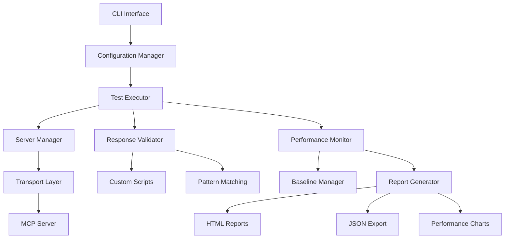

# Mandrel MCP Test Harness - Complete Documentation

A comprehensive testing framework for Model Context Protocol (MCP) servers with enterprise-grade capabilities.

The **Mandrel** project provides the **moth** binary (MOdel context protocol Test Harness) for command-line testing operations.

## 📚 Documentation Index

### 🚀 Getting Started
- **[Installation Guide](installation.md)** - Setup instructions for all environments
- **[Quick Start Tutorial](quick-start.md)** - Your first test in 5 minutes
- **[Basic Configuration](basic-configuration.md)** - Essential configuration patterns

### 👤 User Guides
- **[User Guide](user-guide.md)** - Complete user manual for running tests
- **[Configuration Reference](configuration-reference.md)** - Complete YAML schema documentation
- **[Test Results & Reports](results-and-reports.md)** - Understanding test output and reports

### 🔧 Developer Guides  
- **[Developer Guide](developer-guide.md)** - Extending the test harness
- **[Custom Validators](custom-validators.md)** - Writing custom validation scripts
- **[Adding New Tests](adding-new-tests.md)** - Creating new test definitions

### 🏭 Production & Operations
- **[Production Deployment](production-deployment.md)** - Enterprise deployment guide
- **[Performance Tuning](performance-tuning.md)** - Optimization and scaling
- **[Monitoring & Alerting](monitoring-alerting.md)** - Production monitoring setup

### 🔍 Testing Guides
- **[MCP Protocol Testing](protocol-testing.md)** - Testing MCP protocol compliance
- **[Resource Testing](resource-testing.md)** - Testing MCP resources
- **[Tool Testing](tool-testing.md)** - Testing MCP tools and capabilities
- **[Prompt Testing](prompt-testing.md)** - Testing MCP prompts
- **[Transport Testing](transport-testing.md)** - Testing different transports
- **[Security Testing](security-testing.md)** - Security and compliance validation

### 📋 References
- **[Test Configuration Examples](examples/)** - Real-world configuration examples
- **[Troubleshooting Guide](troubleshooting.md)** - Common issues and solutions
- **[API Reference](api-reference.md)** - Internal APIs and extension points
- **[Migration Guide](migration-guide.md)** - Upgrading between versions

### 🌐 Integration
- **[CI/CD Integration](cicd-integration.md)** - GitHub Actions, GitLab CI, Jenkins
- **[Docker & Containerization](docker-guide.md)** - Container deployment strategies
- **[Cloud Deployment](cloud-deployment.md)** - AWS, GCP, Azure deployment

## 🎯 Quick Navigation

### I want to...
- **Run my first test** → [Quick Start Tutorial](quick-start.md)
- **Test my MCP server** → [User Guide](user-guide.md) 
- **Add custom validation** → [Custom Validators](custom-validators.md)
- **Deploy in production** → [Production Deployment](production-deployment.md)
- **Integrate with CI/CD** → [CI/CD Integration](cicd-integration.md)
- **Fix a problem** → [Troubleshooting Guide](troubleshooting.md)
- **Optimize performance** → [Performance Tuning](performance-tuning.md)

## 🏗️ Architecture Overview

The MCP Test Harness consists of several key components:

### Core Components
- **Configuration Manager**: YAML/JSON configuration parsing and validation
- **Test Executor**: Asynchronous test execution with concurrency control
- **Server Manager**: MCP server lifecycle management (stdio, HTTP, WebSocket)
- **Response Validator**: Pattern matching and custom script validation
- **Performance Monitor**: Real-time monitoring with regression detection
- **Report Generator**: Multi-format reporting with visualizations

## 🔧 Key Features

### Protocol Compliance
- ✅ **MCP Protocol Validation** - Full MCP 2024-11-05 specification compliance
- ✅ **Transport Testing** - stdio, HTTP, WebSocket transport validation
- ✅ **Capability Detection** - Automatic server capability discovery
- ✅ **Error Handling** - Comprehensive error condition testing

### Performance & Scale
- ✅ **Concurrent Execution** - Configurable parallelism with resource limits
- ✅ **Performance Baselines** - Historical performance tracking
- ✅ **Regression Detection** - Automatic performance regression alerts
- ✅ **Stress Testing** - High-load testing capabilities

### Validation & Quality
- ✅ **Pattern Matching** - Flexible response validation patterns
- ✅ **Custom Scripts** - Python/JavaScript custom validation logic
- ✅ **Security Testing** - Built-in security compliance validation
- ✅ **Edge Case Testing** - Comprehensive error and edge case coverage

### Production Ready
- ✅ **CI/CD Integration** - GitHub Actions, GitLab CI, Jenkins support
- ✅ **Docker Support** - Full containerization with multi-stage builds
- ✅ **Monitoring Integration** - Prometheus, Grafana, CloudWatch support
- ✅ **Enterprise Features** - Role-based access, audit logging, compliance reporting

## 📊 Test Categories

### Core Testing
- **Initialization Testing** - Server startup and handshake validation
- **Capability Testing** - Feature detection and capability validation
- **Resource Testing** - File, memory, and network resource testing
- **Tool Testing** - Individual tool functionality validation

### Advanced Testing  
- **Integration Testing** - Multi-tool workflow validation
- **Performance Testing** - Latency, throughput, and resource usage
- **Security Testing** - Authorization, input validation, data protection
- **Compliance Testing** - Protocol compliance and standard conformance

### Specialized Testing
- **Error Condition Testing** - Failure scenarios and error recovery
- **Edge Case Testing** - Boundary conditions and unusual inputs
- **Stress Testing** - High load and resource exhaustion scenarios
- **Regression Testing** - Automated change impact detection

## 🎓 Learning Path

### Beginner (New to MCP Test Harness)
1. [Installation Guide](installation.md) - Set up your environment
2. [Quick Start Tutorial](quick-start.md) - Run your first test
3. [Basic Configuration](basic-configuration.md) - Learn configuration basics
4. [User Guide](user-guide.md) - Master the command-line interface

### Intermediate (Regular User)
1. [Configuration Reference](configuration-reference.md) - Advanced configuration patterns
2. [Test Results & Reports](results-and-reports.md) - Understand test output
3. [Performance Tuning](performance-tuning.md) - Optimize test execution
4. [CI/CD Integration](cicd-integration.md) - Automate testing workflows

### Advanced (Power User/Developer)
1. [Developer Guide](developer-guide.md) - Extend the framework
2. [Custom Validators](custom-validators.md) - Write custom validation logic
3. [Production Deployment](production-deployment.md) - Enterprise deployment
4. [Monitoring & Alerting](monitoring-alerting.md) - Production monitoring

## 🆘 Getting Help

- 📖 **Documentation Issues**: If you find documentation unclear or missing
- 🐛 **Bug Reports**: For software bugs and unexpected behavior  
- 💡 **Feature Requests**: For new functionality suggestions
- ❓ **Usage Questions**: For help with configuration and usage

### Support Channels
- **GitHub Issues**: [Report issues and bugs](https://github.com/rustic-ai/codeprism/issues)
- **GitHub Discussions**: [Community Q&A](https://github.com/rustic-ai/codeprism/discussions)
- **Documentation**: [Complete reference materials](https://docs.codeprism.ai/test-harness)
- **Email Support**: [Direct technical support](mailto:support@codeprism.ai)

---

## 📋 Documentation Maintenance

**Last Updated**: 2025-01-07  
**Version**: 1.0.0  
**Maintainers**: CodePrism Team  

This documentation covers MCP Test Harness v1.0.0 and is regularly updated with new features and improvements. 